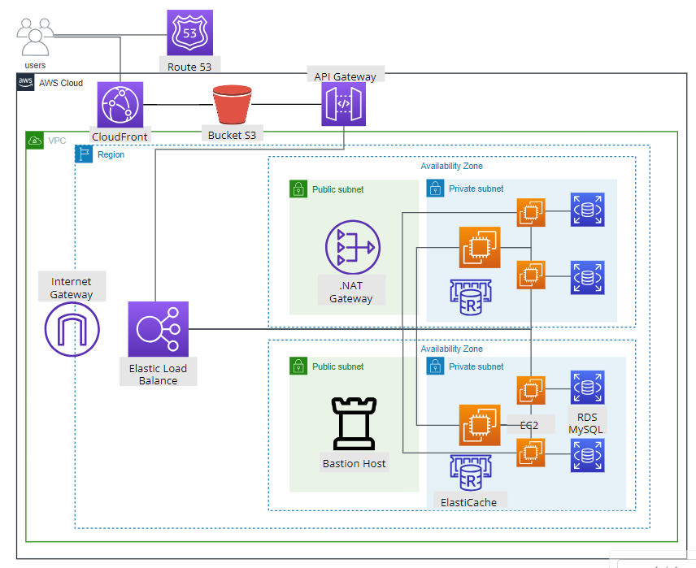

# Arquitetura Corporativa

Figura: Imagem da Arquitetura Corporativa.

Fonte: Desenvolvida pelos autores.

A Arquitetura Corporativa ilustra a estrutura e o fluxo de operações dos serviços de cloud em nosso projeto, implementados dentro de uma Virtual Private Cloud (VPC) na AWS. A VPC oferece um ambiente de rede isolado, que garante que os nossos recursos de nuvem, como EC2, RDS e ElastiCache, sejam seguros e isolados do acesso público desnecessário.

O processo começa com o usuário acessando o front-end, que está hospedado em um bucket do Amazon S3. A distribuição desse conteúdo estático, armazenado no bucket, é feita pelo Amazon CloudFront, que aproveita a rede global de pontos de presença para entregar rapidamente os dados. O endereço IP do front-end é obtido através do serviço de DNS Amazon Route 53.

As interações do usuário com o front-end geram requisições que são direcionadas inicialmente para a Amazon API Gateway. Este serviço atua como uma porta de entrada unificada para as APIs, facilitando tarefas como gestão de tráfego, autorização de acessos e monitoramento de operações. Essas requisições são então enviadas ao Amazon Elastic Load Balancer (ELB), localizado dentro da VPC, que distribui o tráfego entre as instâncias nas zonas de disponibilidade, conforme a demanda aumenta e diminui, trazendo elasticidade para o sistema. As instâncias existentes no back-end são replicadas entre as zonas de disponibilidade. Esta configuração espelhada não apenas balanceia a carga, mas também fornece alta disponibilidade e tolerância a falhas, pois, em caso de indisponibilidade de uma zona, as demais zonas, que são réplicas, podem manter o serviço ativo.

O back-end está localizado dentro de uma subnet privada do VPC, para que não sejam acessíveis diretamente da internet, o que significa que os recursos nelas são protegidos contra acesso direto não autorizado. Isso limita a superfície de ataque, ajudando a prevenir ataques externos.

Por isso, na infraestrutura de rede, existe o NAT Gateway localizado na subnet pública que permite que os serviços nas subnets privadas acessem a internet para tarefas como atualizações e downloads, sem expor esses serviços diretamente.  Além disso, o Internet Gateway indica que as subnets públicas têm acesso direto à internet. Também, na subnet pública, o Bastion Host serve como um ponto seguro e controlado através do qual os desenvolvedores podem acessar e gerenciar o back-end hospedado nas subnets privadas.

A arquitetura de back-end é baseada no princípio de microsserviços, onde cada serviço opera de forma independente e é dedicado a uma função específica dentro da aplicação. Esta estrutura modular permite que cada microsserviço tenha seu próprio banco de dados associado. Assim, múltiplas instâncias do Amazon EC2 são empregadas, cada uma executando um microsserviço distinto, o que facilita a escalabilidade e a manutenção do sistema. Neste contexto, o Amazon RDS com MySQL é utilizado como a solução de banco de dados gerenciado, com uma instância separada para cada API de microsserviço. Isso assegura que cada serviço tenha acesso a um banco de dados otimizado para suas necessidades específicas, e em caso de falhas o Amazon RDS disponibiliza backups automáticos e capacidade de restauração, além de que ele permite escalabilidade vertical (upgrades de instância) e horizontal (leitura réplicas) para maior desempenho do banco de dados. 

Por isso, um EC2 específico é configurado como um barramento de dados. Conectado ao barramento de dados, existe o Amazon ElastiCache, um serviço de armazenamento em cache na memória, que ajuda a aumentar a velocidade de recuperação de dados, reduzindo a latência e o tráfego, e contribuindo para maior escalabilidade do sistema em casos de alta demanda na consulta de dados. Ao receber uma requisição do cliente, após passar pela API Gateway e ser distribuída pelo ELB, a primeira ação do barramento é consultar o Amazon ElastiCache, este passo é fundamental para a eficiência do sistema: se a informação desejada já estiver armazenada em cache, ela pode ser retornada rapidamente ao cliente, poupando recursos computacionais e reduzindo a latência. Somente quando os dados não estão disponíveis no ElastiCache é que o barramento de dados encaminha a requisição para o microsserviço apropriado. O microsserviço, operando em sua própria instância EC2 e com seu próprio banco de dados RDS associado, processa a requisição e, se necessário, atualiza o cache para consultas futuras.