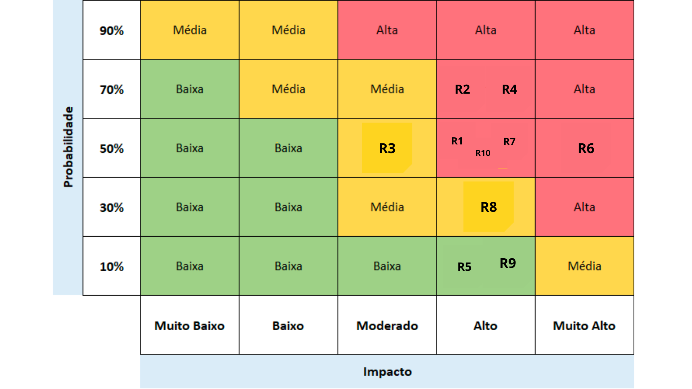
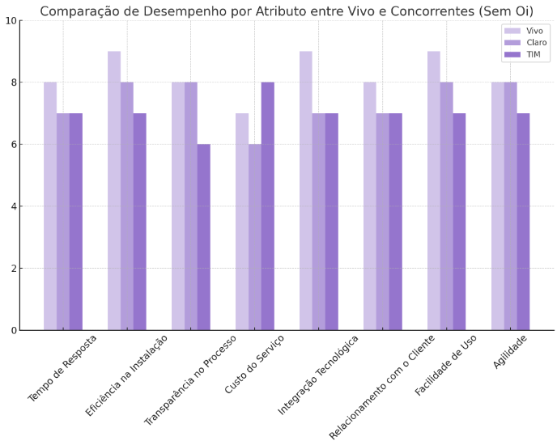
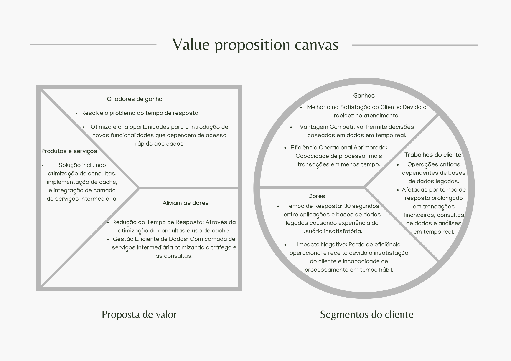

# Entendimento do Negócio

## Matriz de Risco para Projeto de Cloud + On-Premise

### 1. Identificação dos Riscos
- **R1**: Interrupção do Serviço de Cloud (Probabilidade: Média; Impacto: Alto)
- **R2**: Latência de Rede entre Cloud e On-Premise (Probabilidade: Alta; Impacto: Alto)
- **R3**: Exceder o Orçamento devido a Custos de Transferência de Dados (Probabilidade: Média; Impacto: Médio)
- **R4**: Problemas de Compatibilidade entre Sistemas Legados e Nova Infraestrutura (Probabilidade: Alta; Impacto: Alto)
- **R5**: Falha no Sistema de Cache (Probabilidade: Baixa; Impacto: Alto)
- **R6**: Segurança de Dados e Violações de Privacidade (Probabilidade: Média; Impacto: Muito Alto)
- **R7**: Desempenho Inadequado de Aplicações na Cloud (Probabilidade: Média; Impacto: Alto)
- **R8**: Dificuldades na Escalabilidade devido a Limitações de Infraestrutura Legada (Probabilidade: Alta; Impacto: Médio)
- **R9**: Falta de Expertise Técnica na Gestão de Cloud e On-Premise (Probabilidade: Baixa; Impacto: Alto)
- **R10**: Falhas na Implementação do Barramento de Dados (Probabilidade: Média; Impacto: Alto)

### 2. Avaliação e Priorização dos Riscos
- **R6**: Segurança de Dados e Violações de Privacidade
  - Probabilidade: Média
  - Impacto: Muito Alto
  - Prioridade: Muito Alta
  - Justificativa: O impacto muito alto sobre a segurança de dados e violações de privacidade pode ter consequências legais e financeiras significativas.

- **R2**: Latência de Rede entre Cloud e On-Premise
  - Probabilidade: Alta
  - Impacto: Alto
  - Prioridade: Alta
  - Justificativa: Afeta diretamente o desempenho e a experiência do usuário, com alta probabilidade de ocorrência.

- **R4**: Problemas de Compatibilidade entre Sistemas Legados e Nova Infraestrutura
  - Probabilidade: Alta
  - Impacto: Alto
  - Prioridade: Alta
  - Justificativa: Pode causar interrupções significativas nas operações e requer atenção imediata.

- **R1**: Interrupção do Serviço de Cloud
  - Probabilidade: Média
  - Impacto: Alto
  - Prioridade: Média-Alta
  - Justificativa: Afeta a continuidade dos negócios e pode ter consequências financeiras.

- **R7**: Desempenho Inadequado de Aplicações na Cloud
  - Probabilidade: Média
  - Impacto: Alto
  - Prioridade: Média-Alta
  - Justificativa: Impacta a experiência do usuário e a eficiência operacional.

- **R10**: Falhas na Implementação do Barramento de Dados
  - Probabilidade: Média
  - Impacto: Alto
  - Prioridade: Média-Alta
  - Justificativa: Pode afetar a integridade e o desempenho dos dados.

- **R3**: Exceder o Orçamento devido a Custos de Transferência de Dados
  - Probabilidade: Média
  - Impacto: Médio
  - Prioridade: Média
  - Justificativa: Afeta a gestão financeira sem impactar diretamente as operações críticas.

- **R8**: Dificuldades na Escalabilidade devido a Limitações de Infraestrutura Legada
  - Probabilidade: Alta
  - Impacto: Médio
  - Prioridade: Média
  - Justificativa: Afeta a capacidade de crescimento, mas com impacto controlável a curto prazo.

- **R5**: Falha no Sistema de Cache
  - Probabilidade: Baixa
  - Impacto: Alto
  - Prioridade: Média-Baixa
  - Justificativa: Apesar do alto impacto, a baixa probabilidade reduz sua prioridade.

- **R9**: Falta de Expertise Técnica na Gestão de Cloud e On-Premise
  - Probabilidade: Baixa
  - Impacto: Alto
  - Prioridade: Média-Baixa
  - Justificativa: O impacto é significativo, mas a baixa probabilidade permite um planejamento mais estratégico para solução.
=======

## Oceano azul

A Estratégia do Oceano Azul, desenvolvida por W. Chan Kim e Renée Mauborgne em sua obra seminal de 2005, introduz um paradigma revolucionário no contexto da competição de mercado. Esta estratégia desafia a tradicional batalha por participação em mercados altamente concorridos, conhecidos como "oceanos vermelhos", caracterizados por regras estabelecidas e uma feroz disputa entre empresas. Em contraste, a Estratégia do Oceano Azul incentiva as organizações a buscar e criar novos espaços de mercado, denominados "oceanos azuis". Estes são âmbitos ainda não explorados, isentos de competição, onde as convenções ainda não foram estabelecidas, abrindo amplas oportunidades para inovação, crescimento e lucratividade. Em essência, a estratégia enfatiza a importância de transcender as fronteiras de mercado existentes, em favor da descoberta e exploração de novos horizontes, promovendo uma mentalidade de crescimento sustentável e diferenciado.

Oceano Vermelho vs. Oceano Azul: Uma Perspectiva Estratégica

Oceano Vermelho: Este termo descreve os mercados existentes, caracterizados por uma competição acirrada, regras de negócio bem definidas e frequentemente uma luta pela quota de mercado, o que pode levar à saturação e restringir oportunidades de crescimento.

Oceano Azul: Refere-se à exploração ou criação de mercados inteiramente novos, onde as empresas têm a liberdade de definir as regras do jogo, satisfazer demandas inéditas e prosperar de forma mais rentável, deixando para trás a competição tradicional.

A importância da Estratégia do Oceano Azul emerge claramente em vários aspectos chave:

Inovação de Baixo Risco: Motiva as empresas a aventurarem-se além dos confins dos mercados superlotados, em busca de novos territórios com menor concorrência.
Crescimento Lucrativo: As entidades que navegam pelos "oceanos azuis" tendem a gerar receitas e lucros substancialmente mais elevados.
Diferenciação de Mercado: Permite que as organizações estabeleçam uma posição de mercado única, muitas vezes com custos reduzidos, que é profundamente valorizada pelos consumidores.
Transformação Cultural: Encoraja uma mudança de mentalidade organizacional, priorizando a inovação e o valor ao invés da competição direta.
Sustentabilidade a Longo Prazo: Uma implementação bem-sucedida pode garantir uma posição de mercado tão distinta que se torna desafiadora para os concorrentes replicarem.
As Quatro Ações Estratégicas

Dentro desta abordagem estratégica, as quatro ações servem como ferramentas cruciais para desafiar as normas do setor e desbravar novas fronteiras de mercado:

Reduzir: Diminuir ou simplificar os elementos que o setor superestima, possibilitando reduções de custos e otimização de recursos sem comprometer o valor para o consumidor.
Eliminar: Cortar elementos considerados padrão pela indústria que não adicionam valor significativo ao cliente, permitindo uma oferta mais enxuta e a um custo menor.
Aumentar: Intensificar certos aspectos do produto ou serviço bem acima das normas do setor, diferenciando-se significativamente da concorrência e elevando o valor percebido pelos consumidores.
Criar: Introduzir novos elementos que o setor nunca ofereceu, abrindo espaço para inovações que atendam a necessidades não satisfeitas dos consumidores e cultivando um mercado leal.

Aplicando as Quatro Ações ao Projeto

Para integrar, de maneira eficaz, estas ações no contexto de um projeto, é essencial realizar uma análise detalhada dos desejos e necessidades dos clientes, bem como uma avaliação competitiva aprofundada. considerando os oito atributos definidos para o projeto, uma abordagem estratégica detalhada e integrada é essencial. Esta estratégia visa otimizar a infraestrutura de TI, melhorar a eficiência operacional, e aprimorar a experiência do cliente. Vamos detalhar a abordagem para cada atributo, aplicando as quatro ações estratégicas: Reduzir, Eliminar, Aumentar e Criar.

1. **Tempo de Resposta (SLAs - Service Level Agreement)**
Aumentar: Investimentos em tecnologia de caching e soluções de banco de dados em memória para reduzir drasticamente o tempo de acesso aos dados.
Criar: Implementação de uma arquitetura de microserviços para desacoplar componentes e permitir respostas mais rápidas e escaláveis.

2. **Eficiência na Instalação**
Reduzir: Simplificação do processo de instalação através da automação e ferramentas de configuração remota.
Eliminar: Remoção de etapas desnecessárias no processo de instalação que não agregam valor ao cliente ou à eficiência.

3. **Transparência no Processo**
Aumentar: Desenvolvimento de dashboards de monitoramento em tempo real e sistemas de notificação para manter os clientes informados sobre o progresso e qualquer problema potencial.

4. **Custo do Serviço**
Reduzir: Otimização de processos e uso de tecnologias mais eficientes para diminuir o custo operacional, permitindo que o serviço seja oferecido a preços mais competitivos.

5. **Integração Tecnológica**
Criar: Desenvolvimento de uma plataforma de integração que conecta diferentes sistemas e bases de dados de forma mais eficiente, reduzindo a latência.
Relacionamento com o Cliente
Aumentar: Fortalecimento do suporte ao cliente com equipes altamente responsivas e ferramentas de autoatendimento para melhorar a satisfação e lealdade do cliente.

6. **Facilidade de Uso**
Criar: Desenvolvimento de interfaces de usuário intuitivas e processos simplificados que permitem aos clientes acessar facilmente os serviços e gerenciar suas contas sem complicações.

7. **Agilidade**
Aumentar: Implementação de metodologias ágeis e frameworks de desenvolvimento rápido para permitir que a empresa se adapte rapidamente às mudanças do mercado e às necessidades dos clientes.

8. **Implementação Estratégica**
Reduzir: Complexidades desnecessárias nos sistemas atuais, simplificando a arquitetura e processos.
Eliminar: Dependências obsoletas que contribuem para a lentidão no tempo de resposta.
Aumentar: Foco na experiência do cliente e na eficiência operacional, utilizando as melhores práticas e tecnologias disponíveis.
Criar: Novas soluções que oferecem valor agregado aos clientes, aproveitando a infraestrutura otimizada para fornecer serviços inovadores e diferenciados.

Esta abordagem estratégica não só endereça o problema central de tempo de resposta, mas também alinha com os objetivos de melhoria contínua em eficiência, transparência, custo-efetividade, integração tecnológica, relacionamento com o cliente, facilidade de uso e agilidade. Ao focar nessas áreas, a empresa pode não apenas solucionar o problema imediato, mas também se posicionar como líder de mercado, oferecendo uma experiência superior ao cliente.

### Representação gráfica da matriz oceano azul
É importante uma representação gráfica para podermos avaliar a empresa e suas concorrentes com base nos oito atributos decididos.

## Canvas proposta de valor

O Canvas da Proposta de Valor é uma ferramenta essencial para o desenvolvimento e aprimoramento de produtos ou serviços,ele permite que as empresas foquem diretamente nas necessidades e desejos de seus clientes. Este método estruturado facilita a identificação e a compreensão profunda do perfil do cliente, incluindo suas tarefas, dores e ganhos, e como a oferta da empresa pode aliviar essas dores e amplificar esses ganhos. Ao utilizar o Canvas da Proposta de Valor, as organizações podem assegurar que seus esforços de inovação e desenvolvimento sejam orientados pelo mercado e direcionados para criar ofertas que tenham um forte ajuste ao mercado. Isso não apenas aumenta as chances de sucesso do produto, mas também contribui para uma alocação de recursos mais eficiente, minimizando o risco e o desperdício em desenvolver ofertas que não atendem às necessidades reais dos clientes.

## Análise Financeira

A análise financeira a seguir oferece uma visão detalhada dos custos e benefícios associados ao desenvolvimento e implantação do projeto de simulação do sistema da Vivo. Os aspectos econômicos relevantes são divididos em duas categorias principais:

### a) Otimização de Recursos de Infraestrutura

#### Redução de Custos Operacionais:
A implementação eficiente do projeto de simulação do sistema da Vivo tem o potencial de aumentar as eficiências operacionais e diminuir os custos relacionados à infraestrutura de TI. Aqui estão alguns importantes:

- **Arquitetura Baseada em Microserviços**: A transição para uma arquitetura baseada em microserviços permite uma alocação de recursos mais eficiente, facilitando a escalabilidade e evitando despesas desnecessárias com recursos subutilizados.

- **Utilização de Tecnologias em Nuvem**: Ao utilizar serviços em nuvem da AWS, como Amazon EC2, RDS para MySQL e ElastiCache, podemos diminuir os custos de hardware e manutenção, além de permitir uma implantação mais rápida e flexível.

- **Substituição de Data Lakes por Serviços AWS**: Ao transferir o data warehouse existente para soluções nativas da AWS, como Amazon S3 e Amazon Redshift, podemos diminuir os custos operacionais e simplificar a gestão de dados.

#### Melhoria da Eficiência Operacional:
Além da redução de custos, a otimização da infraestrutura também pode melhorar a eficiência operacional da Vivo, garantindo uma entrega de serviços mais rápida e confiável para seus usuários finais.

### b) Custo do Projeto

#### Despesas Estimadas:
O desenvolvimento e implementação do projeto envolvem gastos em diversas áreas, incluindo a infraestrutura necessária na nuvem para suportar as operações do sistema da Vivo. Abaixo estão os custos estimados dos principais serviços de infraestrutura na nuvem da AWS:

| Serviço           | Quantidade | Preço Unitário (USD mensal) | Total (USD mensal) | Total (USD anual) |
|-------------------|------------|----------------------|-------------| ---------------|
| Amazon EC2        | 8          | $3.80                | $30.37    | $364.44    |
| Amazon RDS        | 5          | $362.30                | $1,811.50    | $21,738.00    |
| Amazon ElastiCache| 1          | $180.60                | $180.60    | $2,167.20    |
| **Total**  |            |                      | **$2022.47**| **$24,269.64**|

A tabela apresenta os custos mensais e anuais estimados dos principais serviços de infraestrutura na nuvem da AWS necessários para o projeto. O Amazon EC2 fornece capacidade de computação escalável, o Amazon RDS oferece serviços de banco de dados gerenciados e o Amazon ElastiCache proporciona recursos de cache na nuvem. Esses serviços são essenciais para suportar as operações do sistema da Vivo, garantindo flexibilidade, escalabilidade e eficiência operacional.

#### Considerações Financeiras:
- **Investimento Inicial**: O investimento inicial necessário para iniciar o projeto inclui os custos de configuração da infraestrutura na nuvem e a migração dos data lakes existentes para serviços da AWS.

- **Retorno sobre o Investimento (ROI)**: Embora uma estimativa específica de economia não esteja disponível neste momento, podemos projetar um ROI significativo com base nas melhorias operacionais esperadas. Estimamos que a implementação eficiente do projeto de simulação do sistema da Vivo pode resultar em uma redução de custos operacionais de até 20%, considerando as economias geradas pela transição para uma arquitetura baseada em microserviços, a utilização de tecnologias em nuvem e a otimização da infraestrutura. Além disso, é importante ressaltar que, se o projeto for bem-sucedido e o tempo de resposta for reduzido de 30 segundos para menos de 3 segundos, é esperado um aumento significativo na satisfação do cliente e, consequentemente, uma maior retenção de clientes. Esses fatores contribuem para um ROI positivo e sustentável a longo prazo.

Para uma análise detalhada dos custos da AWS, incluindo os cálculos específicos para cada serviço e uma previsão de gastos ao longo do tempo, consulte o PDF anexo: [Análise de Custos AWS](./anexos/Estimativa%20aws.pdf).

Com essa análise financeira, fornecemos uma base para avaliar os custos e benefícios do projeto do sistema da Vivo, permitindo uma tomada de decisão informada e estratégica em relação aos investimentos e recursos necessários.

