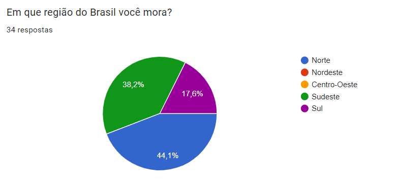
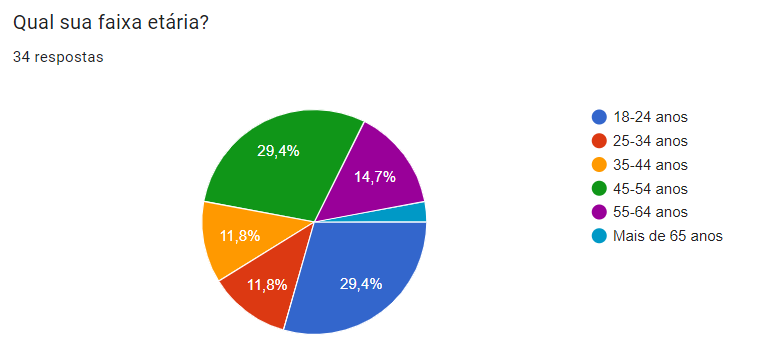
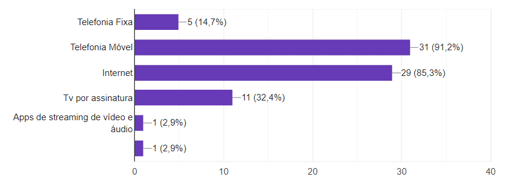
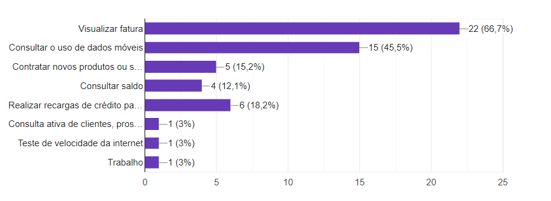
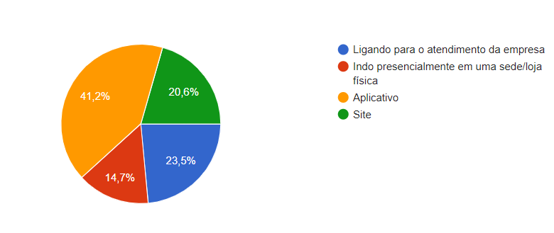
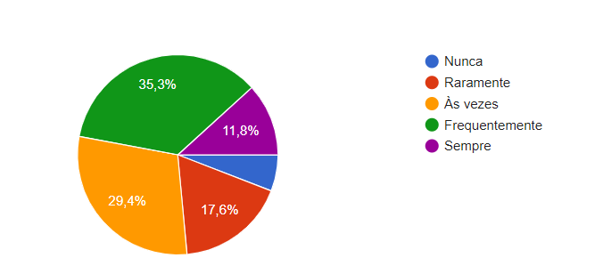
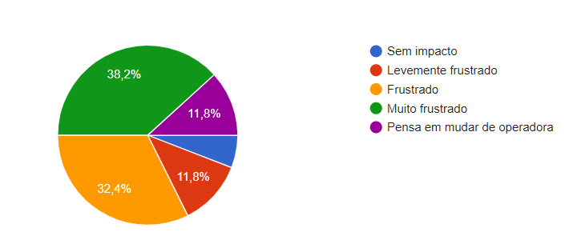
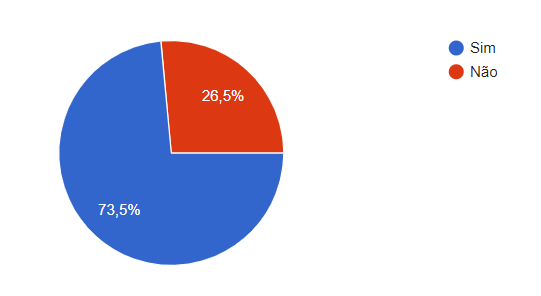
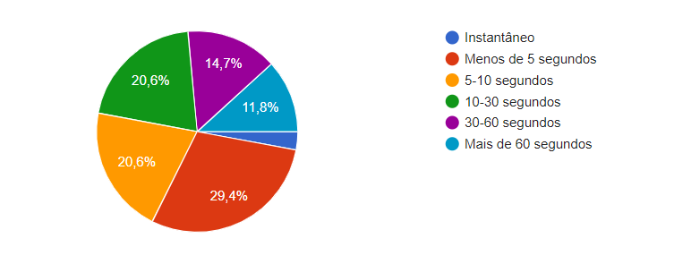

# Entendimento do Usuário

## Introdução

O projeto proposto visa enfrentar um desafio crítico encontrado pela Vivo Telefônica, uma das principais empresas de telecomunicações no Brasil e integrante do Grupo Telefônica. Com o objetivo de compreender profundamente o problema e como os usuários são afetados, foram realizadas pesquisas aprofundadas no contexto do problema. 

Isto foi essencial para identificar os obstáculos enfrentados pela empresa e entender como eles impactam o funcionamento do sistema e a experiência dos usuários. A importância dessa iniciativa reside na obtenção de insights detalhados que guiarão o desenvolvimento de soluções eficazes, melhorando a experiência do usuário e otimizando os serviços prestados pela Vivo Telefônica.

## Imersão Preliminar

Para uma imersão preliminar no problema do projeto, realizou-se uma pesquisa exploratória. Os insights e o entendimento do contexto do projeto foram obtidos através de fontes como TAPI, um documento explicativo do escopo do projeto, e um workshop com representantes da Vivo, que explicaram e esclareceram dúvidas sobre as necessidades que a solução desenvolvida visa atender.

A partir do TAPI, foi possível obter uma visão geral do problema e do escopo da solução. Esta fase foi crucial para que os membros do grupo pudessem discutir e alinhar ideias relativas às possíveis soluções e objetivos, levando em consideração os requisitos e as expectativas para o MVP, conforme explicitado no documento.

Durante o workshop, a equipe já estava familiarizada com o contexto do problema e da solução. Isso possibilitou a aplicação do entendimento adquirido por meio do TAPI para obter validações sobre o cenário em questão e quais propostas de solução eram válidas. Além disso, o workshop foi essencial para um entendimento mais profundo da parte técnica relacionada às tecnologias da Vivo Telefônica, delineando o que é esperado e como a solução pode ser desenvolvida.

**Identificação do Problema:**

A problemática central identificada é a demora no acesso às bases de dados legadas, que compromete significativamente o tempo de carregamento de informações nos sistemas da Vivo. Essa latência, que pode chegar a aproximadamente 30 segundos, deteriora a experiência do usuário, atrasando as respostas e prejudicando a eficiência dos serviços prestados. Diante disso, a Vivo busca uma solução que possa não apenas acelerar esse processo, mas também aumentar a escalabilidade do sistema, visando a uma melhoria contínua na satisfação dos clientes.

**Usuário Representativo:**

Durante a imersão preliminar, identificamos a persona representativa dos usuários finais da Vivo Telefônica que enfrentam desafios devido à demora no acesso às bases de dados legadas. A persona representa os consumidores que interagem com os serviços da Vivo.

As principais características da persona incluem:

- **Perfil Demográfico:** Clientes variados, abrangendo diferentes faixas etárias e perfis socioeconômicos, refletindo a diversidade do público da Vivo Telefônica.

- **Necessidades e Desafios:** Os clientes enfrentam frustrações devido à demora no acesso a informações, o que impacta diretamente sua experiência ao utilizar os serviços da Vivo.

- **Comportamentos e Expectativas:** Buscam uma experiência de usuário fluida e eficiente ao interagir com os serviços da Vivo. Valorizam a rapidez na obtenção de informações e esperam soluções que atendam às suas necessidades de maneira ágil.

- **Contexto Tecnológico:** Apresentam diferentes níveis de familiaridade com as tecnologias, sendo essencial considerar uma abordagem que atenda tanto a usuários mais experientes quanto a aqueles menos familiarizados com sistemas complexos.

**Insights:**

1. **Uso de Cloud Computing para Escalabilidade:** A adoção de serviços de computação em nuvem possibilita o dimensionamento automático do sistema, adequando-se à demanda variável e garantindo a disponibilidade dos serviços mesmo durante picos de uso.

2. **Caching de Dados para Redução de Latência:** Armazenando informações frequentemente acessadas em uma camada de cache, é possível diminuir significativamente o tempo de consulta, evitando a sobrecarga da base de dados legada e acelerando a resposta do sistema.

3. **Otimização do Acesso à Informação:** A solução proposta elimina a necessidade de buscar repetidamente as mesmas informações na base de dados legada, otimizando o processo de consulta e melhorando a eficiência do sistema.

4. **Melhoria na Experiência do Usuário:** Espera-se que, ao implementar estas medidas, haja uma redução substancial no tempo de espera por informações, elevando a qualidade do serviço oferecido e a satisfação do usuário.

## Pesquisa QualiQuantitativa

Com o objetivo de compreender de maneira aprofundada as percepções, comportamentos e necessidades dos usuários da Vivo em relação ao problema tratado, a equipe desenvolveu uma pesquisa qualiquantitativa. A abordagem qualiquantitativa combina elementos qualitativos e quantitativos, permitindo uma análise mais abrangente e aprofundada das características essenciais que influenciam a experiência do usuário.

Nesta seção, apresentaremos a metodologia adotada, que se baseia na coleta de dados por meio de um formulário de pesquisa elaborado pelo grupo. O método de amostragem bola de neve, que consiste em encaminhar para pessoas que se encaixam no perfil e pedir para que essas pessoas, além de responderem, encaminhem para 3 conhecidos que se enquadrem na persona representativa, foi escolhido deliberadamente para garantir a representatividade dos respondentes, direcionando-nos a perfis específicos de usuários identificados durante a imersão preliminar.

A pesquisa permaneceu aberta por uma semana, durante a qual recebemos um total de 34 respostas valiosas. Essas contribuições desempenharam um papel fundamental no aprofundamento da nossa compreensão da experiência do usuário e a diversidade de feedbacks recebidos nos permitiu identificar padrões significativos.

### Distribuição geográfica dos Usuários 

O gráfico abaixo destaca a dispersão geográfica das respostas dos usuários no formulário, evidenciando a extensiva participação em diversas regiões do Brasil. Essa representação é crucial, pois sublinha a necessidade de respostas abrangentes que capturem a diversidade geográfica do público da Vivo. 

Figura: Gráfico de respostas do formulário de pesquisa.

Fonte: Captura de Tela do Google Forms.

**Insights:** Validando o que foi concluído na imersão preliminar sobre os usuários representativos do projeto, as respostas de clientes da Vivo consistiram em regiões diversas do Brasil.

### Faixa etária do Usuários

Assim como a diversidade geográfica, os clientes do parceiro englobam uma ampla faixa etária, desde jovens adultos até idosos. O gráfico abaixo ilustra essa variabilidade, apresentando a diversidade de idades dos usuários que contribuíram para a pesquisa. Esta representação visual destaca a importância de considerar as diferentes perspectivas geracionais.

Figura: Gráfico de respostas do formulário de pesquisa.

Fonte: Captura de Tela do Google Forms.

**Insights:** Assim como o perfil demográfico, por meio dessa pesquisa foi comprovada a ampla variedade de idades dos clientes da empresa parceira em questão. A diversidade de idades implica que a empresa deve considerar várias abordagens para atendimento ao cliente, suporte técnico e design de interface.

### Principais produtos contratados pelos Usuários

No gráfico abaixo, desvendamos os principais produtos que os clientes escolhem ao contratar serviços da Vivo. Essa visualização oferece uma perspectiva clara sobre as preferências e demandas dos usuários, auxiliando na compreensão de possíveis padrões de atrasos no acesso aos dados do sistema. 

Figura: Gráfico de respostas do formulário de pesquisa.

Fonte: Captura de Tela do Google Forms.

**Insights:** Os produtos mais utilizados são 'Telefonia Móvel' e 'Internet'. Isto não é surpreendente, dado o papel crítico que a conectividade móvel e o acesso à internet desempenham na sociedade contemporânea. 

### Principais serviços utilizados pelos Usuários

Assim como no gráfico acima, esta próxima visualização tem como objetivo ilustrar os serviços cotidianos mais utilizados pelos usuários. Ao mergulharmos nessa análise, ganhamos uma perspectiva valiosa sobre os serviços que frequentemente requerem consultas de dados, permitindo-nos correlacionar esses padrões com possíveis demoras na consulta. 

Figura: Gráfico de respostas do formulário de pesquisa.

Fonte: Captura de Tela do Google Forms.

**Insights:** Os principais tipos de serviços utilizados pelos usuários são com os objetivos de visualizar suas faturas de pagamento e consultar seus dados móveis. Ambos os serviços demandam consultas de dados específicas do usuário em questão, o que pode ocasionar uma demora no carregamento ao acessar os bancos de dados legados, como foi citado na imersão preliminar.

### Meio de acesso dos serviços

No gráfico abaixo, exploramos os meios de comunicação preferidos pelos usuários ao acessar os serviços da Vivo. Esta visualização oferece uma visão panorâmica dos principais canais utilizados pelos usuários, revelando insights sobre as preferências de comunicação. Compreender essas preferências do usuário é imprescindível para elevar a satisfação do cliente a níveis excepcionais. 

Figura: Gráfico de respostas do formulário de pesquisa.

Fonte: Captura de Tela do Google Forms.

**Insights:**  O predomínio da preferência dos clientes por acessar online, seja por meio de aplicativo ou site, destaca a importância crucial de manter e aprimorar continuamente um sistema online eficiente.

### Enfrentamento de demoras no carregamento

Com o intuito de mapear a frequência com que os usuários enfrentam atrasos ao consultar seus serviços, o gráfico apresenta a distribuição das respostas. 

Figura: Gráfico de respostas do formulário de pesquisa.

Fonte: Captura de Tela do Google Forms.

**Insights:**  A análise revela que 35,3% dos clientes frequentemente enfrentam demoras ao consultar seus serviços. Essa constatação destaca a necessidade De implementar soluções direcionadas para melhorar a eficiência e reduzir significativamente os tempos de espera. 

### Impacto nas demoras de carregamentos

Com o objetivo de entender o impacto gerado, pelos atrasos nas consultas, na experiência do cliente, o gráfico abaixo mostra a distribuição de respostas dos usuários sobre.

Figura: Gráfico de respostas do formulário de pesquisa.

Fonte: Captura de Tela do Google Forms.

Para entender o quanto isso pode ser um risco de perda de clientes, o gráfico abaixo mostra a distribuição de respostas para a pergunta "A demora no carregamento, ao acessar, já o levou a usar menos os serviços?".

Figura: Gráfico de respostas do formulário de pesquisa.

Fonte: Captura de Tela do Google Forms.

**Insights:** A análise do gráfico superior revela que 38,2% dos clientes sentem-se muito frustrados com demoras no carregamento ao acessar o serviço da operadora. Além de uma parcela significativa (32,4%) se sente frustrada. Correlacionando com o segundo gráfico, esses clientes respondem em sua maioria que tendem a usar menos os serviços. Essa constatação sublinha a importância de melhorar os tempos de carregamento para aumentar a satisfação geral do cliente e reduzir o risco de perda de clientes.

### Tempo máximo de espera ao consultar os serviços

Para entender as expectativas do usuário em relação ao tempo de carregamento dos serviços, o gráfico abaixo mostra a variabilidade de respostas dos usuários sobre qua o tempo máximo aceitável de espera.

Figura: Gráfico de ações imediatas diante de demoras no serviço.

Fonte: Captura de Tela do Google Forms.

**Insights:**  A partir do gráfico, pode-se observar que as expectativas dos usuários quanto ao tempo de espera variam consideravelmente. A maior porção de usuários (29,4%) espera que o serviço carregue em no máximo 5 segundos, refletindo a demanda por respostas rápidas na era digital. Outros 20,6% estão confortáveis esperando de 5 a 10 segundos, o que ainda indica a preferência por uma resposta rápida. Uma parcela idêntica de 20,6% pode tolerar um atraso de 10 a 30 segundos. Apenas 2,9% dos respondentes desejam que seja instantâneo. Outros grupos, são tolerantes a um tempo de espera maior. Esses insights ressaltam uma clara expectativa do mercado por eficiência e rapidez no acesso a serviços digitais, sugerindo que melhorias na infraestrutura podem ser cruciais para aumentar a satisfação do cliente e manter a competitividade no mercado.

## Conclusão

A conclusão da pesquisa qualiquantitativa oferece uma validação robusta das descobertas obtidas na imersão preliminar realizada para o projeto da Vivo Telefônica. As evidências coletadas confirmam que a empresa enfrenta um desafio significativo relacionado à demora no carregamento de dados das bases legadas, um problema que impacta diretamente a experiência do usuário e a percepção de eficácia dos serviços prestados.

Os dados coletados também corroboram o entendimento de que o perfil dos usuários da Vivo é bastante diversificado, abrangendo uma gama ampla de faixas etárias, preferências e comportamentos. Essa diversidade reflete a necessidade de uma solução que seja inclusiva e eficiente para atender às diferentes expectativas e necessidades. O perfil dos usuários sugere que a Vivo deve considerar a usabilidade e o acesso facilitado como fatores chave no desenvolvimento de suas soluções, garantindo que estas sejam acessíveis a todos os segmentos de clientes.

A pesquisa oferece insights importantes sobre as expectativas dos usuários em relação aos tempos de carregamento, evidenciando uma clara demanda por serviços mais rápidos e responsivos. Com base nesses insights, torna-se evidente a necessidade de uma solução que aumente a escalabilidade dos sistemas da Vivo, priorizando o aprimoramento de sua infraestrutura para reduzir latências e melhorar a performance.
