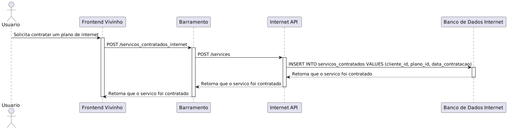

# Modelagem

## Diagrama de casos de uso

O diagrama de casos de uso representa a interação dos clientes com um sistema de serviços de telecomunicações. Ele ilustra as principais funcionalidades disponíveis para o usuário e as ações que eles podem realizar. O diagrama é projetado para fornecer uma visão de alto nível dos requisitos funcionais do sistema e como os usuários finais interagem com ele.

## Descrição dos Casos de Uso
### Caso de Uso 1: Cadastro de Cliente (RF1)

- **Escopo:** Sistema de Cadastro de Cliente para a plataforma de serviços.
- **Nível:** Microserviço.
- **Atores:** Cliente(usuário final).
- **Interessados e Interesses:** Clientes interessados em se cadastrar no sistema.
- **Pré-condições:** O sistema deve estar operacional, e o microserviço de cadastro deve estar acessível.
- **Pós-condições:**  Dados do cliente registrados e conta criada no sistema.
- **Fluxo Básico:**
  1. Cliente inicia o processo de cadastro na plataforma.
  2. Cliente preenche o formulário de cadastro com informações pessoais.
  3. Sistema valida as informações e cria uma nova conta.
  4. Cliente recebe confirmação de cadastro bem-sucedido.
- **Fluxos Alternativos:**
  - Caso a validação falhe (dados inválidos ou incompletos), o cliente é solicitado a corrigir as informações.
- **Requisitos Especiais:** Garantia de segurança dos dados fornecidos pelo cliente.
- **Lista de Variantes:** Nenhuma.
- **Frequência de Ocorrência:** Alta.
- **Problemas em Aberto:** A determinar, com base na interação dos usuários durante o cadastro.

### Caso de Uso 2: Consulta de Fatura (RF2)

- **Escopo:** SVisualização de faturas emitidas na plataforma de serviços.
- **Nível:** Microserviço.
- **Atores:** Cliente.
- **Interessados e Interesses:** Clientes interessados em um meio rápido e conveniente para vizualizarem suas faturas recentes.
- **Pré-condições:** Microserviço de Consulta de Fatura ativo, dados disponíveis no cache ou banco de dados específico.
- **Pós-condições:** Cliente visualiza detalhes da fatura.
- **Fluxo Básico:**
  1. Cliente acessa a interface de consulta de fatura.
  2. Sistema verifica se há dados em cache.
  3. Se não houver dados em cache, o sistema consulta o banco de dados específico.
  4. O sistema apresenta detalhes da fatura ao cliente.
- **Fluxos Alternativos:**
  - Falha na conexão com o banco de dados ou no acesso ao cache.
  - Não há fatura disponível para o cliente, nesse caso, o cliente é informado da indisponibilidade.
- **Requisitos Especiais:** Acesso rápido aos dados, priorizando o uso do cache quando disponível.
- **Lista de Variantes:** Consulta detalhada ou resumida da fatura.
- **Frequência de Ocorrência:** Alta considerando o ciclo regular de faturamento.
- **Problemas em Aberto:** Otimização do sistema de cache para assegurar a atualização e a disponibilidade das faturas.

### Caso de Uso 3: Acesso à Internet Residencial e Empresarial (RF3)

- **Escopo:**  Serviço de visualização de detalhes de acesso à Internet para clientes residenciais e empresariais.
- **Nível:** Microserviço.
- **Atores:** Cliente.
- **Interessados e Interesses:**  Clientes buscam informações sobre a qualidade e opções de seus serviços de Internet.
- **Pré-condições:** Microserviço de Acesso à Internet ativo, dados disponíveis no cache ou banco de dados específico.
- **Pós-condições:** Cliente tem conhecimento sobre o estado atual do seu serviço de Internet e opções de upgrade.
- **Fluxo Básico:**
  1. Cliente acessa a interface de consulta de serviços de acesso à internet.
  2. Sistema verifica se há dados em cache.
  3. Se não houver dados em cache, o sistema consulta o banco de dados específico.
  4. O sistema apresenta detalhes sobre velocidades de conexão, planos disponíveis e opções de upgrades ao cliente.
- **Fluxos Alternativos:**
  - Falha na conexão com o banco de dados ou no acesso ao cache.
  - Não há informações disponíveis para o cliente.
- **Requisitos Especiais:** Acesso rápido aos dados, priorizando o uso do cache quando disponível.
- **Lista de Variantes:** Consulta detalhada ou resumida sobre os serviços de acesso à internet.
- **Frequência de Ocorrência:** Alta.
- **Problemas em Aberto:** Possíveis problemas de desempenho caso o cache não esteja atualizado.

### Caso de Uso 4: Telefonia Fixa e Móvel (RF4)

- **Escopo:** onsulta de detalhes dos serviços de telefonia disponíveis para o cliente.
- **Nível:** Microserviço.
- **Atores:** Cliente.
- **Interessados e Interesses:** Clientes interessados em visualizar detalhes dos seus serviços de telefonia e explorar opções adicionais.
- **Pré-condições:** Microserviço de Consulta de Telefonia ativo, dados disponíveis no cache ou banco de dados específico.
- **Pós-condições:** Cliente visualiza detalhes dos serviços de telefonia e opções de alteração de planos.
- **Fluxo Básico:**
  1. Cliente acessa a interface de consulta de telefonia.
  2. Sistema verifica se há dados em cache.
  3. Se não houver dados em cache, o sistema consulta o banco de dados específico.
  4. O sistema apresenta detalhes dos serviços de telefonia ao cliente, com opção para mudanças ou atualizações.
- **Fluxos Alternativos:**
  - Falha na conexão com o banco de dados ou no acesso ao cache.
  - Não há serviços de telefonia disponíveis para o cliente.
- **Requisitos Especiais:** Acesso rápido aos dados, priorizando o uso do cache quando disponível.
- **Lista de Variantes:** Consulta detalhada ou resumida dos serviços de telefonia.
- **Frequência de Ocorrência:** Alta.
- **Problemas em Aberto:** Possíveis problemas de desempenho caso o cache não esteja atualizado, assegurar a consistência das informações entre o cache e o banco de dados.

### Caso de Uso 5: TV e Streaming (RF5)

- **Escopo:** Visualização de informações sobre produtos e serviços adicionais, como TV por assinatura e streaming.
- **Nível:** Microserviço.
- **Atores:** Cliente.
- **Interessados e Interesses:** Clientes desejam acessar e gerenciar suas assinaturas de TV e serviços de streaming e explorar opções adicionais.
- **Pré-condições:** Microserviço de Consulta de Outros Serviços ativo, dados disponíveis no cache ou banco de dados específico.
- **Pós-condições:** Cliente possui uma visão clara dos serviços de TV/Streaming subscritos.
- **Fluxo Básico:**
  1. Cliente acessa a interface de consulta de Tv e Streaming.
  2. Sistema verifica se há dados em cache.
  3. Se não houver dados em cache, o sistema consulta o banco de dados específico.
  4. O sistema apresenta detalhes dos serviços adicionais ao cliente.
- **Fluxos Alternativos:**
  - Falha na conexão com o banco de dados ou no acesso ao cache.
  - Não há serviços adicionais disponíveis para o cliente.
- **Requisitos Especiais:** Acesso rápido aos dados, priorizando o uso do cache quando disponível.
- **Lista de Variantes:** Consulta detalhada ou resumida dos serviços adicionais.
- **Frequência de Ocorrência:** Alta.
- **Problemas em Aberto:** Possíveis problemas de desempenho caso o cache não esteja atualizado.

## Diagrama de Implantação UML e sua descrição textual

O Diagrama de Implantação UML proposto representa a arquitetura da solução para o problema de tempo de resposta em consultas a bancos de dados legados. A solução proposta envolve a criação de um cache para otimizar o acesso às informações, utilizando microserviços no ambiente da AWS.

## Componentes Principais

1. **Frontend (EC2):**
   - Descrição: Interface de usuário acessível via navegador.
   - Implantação: Hospedado na AWS EC2.

2. **Microserviços (EC2):**
   - Descrição: Conjunto de microserviços, cada um responsável por atender a um requisito funcional específico.
   - Implantação: Executado em instâncias EC2.

3. **Barramento:**
   - Descrição: Barramento de dados central que gerencia a comunicação entre os microserviços.
   - Implantação: Executado em instâncias EC2.

4. **Cache:**
   - Descrição: Cache para armazenamento temporário de dados.
   - Implantação: Executado em instâncias ElastiCache.

5. **Bancos de Dados Específicos:**
   - Descrição: Bancos de dados individuais para cada microserviço.
   - Implantação: Executando em RDS.

## Diagramas de Sequencia UML e suas descrições textuais

### Diagrama de sequencia para Login

**Login:**

- O usuário solicita fazer login inserindo seu e-mail e senha.
- O Frontend Vivinho envia uma solicitação POST à autenticação API para verificar as credenciais do usuário.
  - A Autenticação API verifica as credenciais no Banco de Dados de Usuários.
  - Se as credenciais estiverem corretas, a Autenticação API retorna um token de autenticação ao Frontend Vivinho.
- O Frontend Vivinho armazena o token de autenticação e redireciona o usuário para a página inicial.

Observação: Considerou-se que o usuário já está autenticado, e o token de autenticação é utilizado para validar o acesso em cada solicitação subsequente.

### Diagrama de sequencia para Cadastro de um novo Cliente

**Cadastro de um novo Cliente:**

- O usuário solicita se cadastrar inserindo seus dados pessoais.
- O Frontend Vivinho envia uma solicitação POST à autenticação API para criar um novo cliente.
  - A Autenticação API verifica se o e-mail já está cadastrado no Banco de Dados de Usuários.
  - Se o e-mail não estiver cadastrado, a Autenticação API adiciona o novo cliente ao Banco de Dados de Usuários.
- Após a confirmação do cadastro, a Autenticação API retorna um token de autenticação ao Frontend Vivinho.
- O Frontend Vivinho armazena o token de autenticação e redireciona o usuário para a página inicial.

Observação: Considerou-se que o usuário já está autenticado após o cadastro bem-sucedido.

### Diagrama de sequencia para Consulta dos Planos de Telefonia

**Consulta dos Planos de Telefonia:**

- O usuário solicita ver todos os serviços de telefonia disponíveis.
- O Frontend Vivinho envia uma solicitação GET ao Barramento para obter os planos de telefonia.
- O Barramento verifica se as informações estão armazenadas em cache.
  - Se estiverem em cache, os planos de telefonia são recuperados e retornados ao Frontend Vivinho.
  - Caso contrário, o Barramento faz uma requisição à Telefonia API para obter os planos.
    - A Telefonia API consulta o Banco de Dados de Telefonia para recuperar os planos disponíveis.
    - Os planos são retornados à Telefonia API, que os repassa para o Barramento.
- Os planos de telefonia são então retornados ao Frontend Vivinho pelo Barramento.

### Diagrama de sequencia para Consulta dos Serviços Contratados por um Cliente de Telefonia

**Consulta dos Serviços Contratados por um Cliente de Telefonia:**

- O usuário solicita ver todos os serviços de telefonia contratados por ele.
- O Frontend Vivinho envia uma solicitação GET ao Barramento para obter os serviços contratados de telefonia.
- O Barramento verifica se as informações estão armazenadas em cache.
  - Se estiverem em cache, os serviços contratados de telefonia são recuperados e retornados ao Frontend Vivinho.
  - Caso contrário, o Barramento faz uma requisição à Telefonia API para obter os serviços contratados.
    - A Telefonia API consulta o Banco de Dados de Telefonia para recuperar os serviços contratados pelo cliente.
    - Os serviços contratados são retornados à Telefonia API, que os repassa para o Barramento.
- Os serviços contratados de telefonia são então retornados ao Frontend Vivinho pelo Barramento.

### Diagrama de sequencia para um cliente Contratar um plano de Telefonia

**Contratação de um plano de Telefonia:**

- O usuário solicita contratar um plano de telefonia.
- O Frontend Vivinho envia uma solicitação POST ao Barramento para contratar um plano de telefonia.
- O barramento encaminha a solicitação à Telefonia API para adicionar o plano de telefonia ao cliente.
  - A Telefonia API adiciona o plano ao cliente no Banco de Dados de Telefonia.
  - Após a confirmação da adição do plano, a Telefonia API retorna uma resposta de sucesso ao Barramento.
- O Barramento retorna a resposta ao Frontend Vivinho.

### Diagrama de sequencia para cancelar um plano de Telefonia

**Cancelamento de um plano de Telefonia:**

- O usuário solicita cancelar um plano de telefonia.
- O Frontend Vivinho envia uma solicitação PATCH ao Barramento para atualizar o serviço contratado adicionando data de cancelamento.
- O barramento encaminha a solicitação à Telefonia API para cancelar o plano de telefonia do cliente.
  - A Telefonia API atualiza o plano do cliente no Banco de Dados de Telefonia, adicionando a data de cancelamento.
  - A Telefonia API retorna uma resposta de sucesso ao Barramento.
- O Barramento retorna a resposta ao Frontend Vivinho.

### Diagrama de sequencia para Consulta dos Planos de Internet

**Consulta dos Planos de Internet:**

- O usuário solicita ver todos os serviços de internet disponíveis.
- O Frontend Vivinho envia uma solicitação GET ao Barramento para obter os planos de internet.
- O Barramento verifica se as informações estão armazenadas em cache.
  - Se estiverem em cache, os planos de internet são recuperados e retornados ao Frontend Vivinho.
  - Caso contrário, o Barramento faz uma requisição à Internet API para obter os planos.
    - A Internet API consulta o Banco de Dados de Internet para recuperar os planos disponíveis.
    - Os planos são retornados à Internet API, que os repassa para o Barramento.
- Os planos de internet são então retornados ao Frontend Vivinho pelo Barramento.

### Diagrama de sequencia para Consulta dos Serviços Contratados por um Cliente de Internet

**Consulta dos Serviços Contratados por um Cliente de Internet:**

- O usuário solicita ver todos os serviços de internet contratados por ele.
- O Frontend Vivinho envia uma solicitação GET ao Barramento para obter os serviços contratados de internet.
- O Barramento verifica se as informações estão armazenadas em cache.
  - Se estiverem em cache, os serviços contratados de internet são recuperados e retornados ao Frontend Vivinho.
  - Caso contrário, o Barramento faz uma requisição à Internet API para obter os serviços contratados.
    - A Internet API consulta o Banco de Dados de Internet para recuperar os serviços contratados pelo cliente.
    - Os serviços contratados são retornados à Internet API, que os repassa para o Barramento.
- Os serviços contratados de internet são então retornados ao Frontend Vivinho pelo Barramento.

### Diagrama de sequencia para um cliente Contratar um plano de Internet

**Contratação de um plano de Internet:**

- O usuário solicita contratar um plano de internet.
- O Frontend Vivinho envia uma solicitação POST ao Barramento para contratar um plano de internet.
- O barramento encaminha a solicitação à Internet API para adicionar o plano de internet ao cliente.
  - A Internet API adiciona o plano ao cliente no Banco de Dados de Internet.
  - Após a confirmação da adição do plano, a Internet API retorna uma resposta de sucesso ao Barramento.
- O Barramento retorna a resposta ao Frontend Vivinho.

### Diagrama de sequencia para cancelar um plano de Internet

**Cancelamento de um plano de Internet:**

- O usuário solicita cancelar um plano de internet.
- O Frontend Vivinho envia uma solicitação PATCH ao Barramento para atualizar o serviço contratado adicionando data de cancelamento.
- O barramento encaminha a solicitação à Internet API para cancelar o plano de internet do cliente.
  - A Internet API atualiza o plano do cliente no Banco de Dados de Internet, adicionando a data de cancelamento.
  - A Internet API retorna uma resposta de sucesso ao Barramento.
- O Barramento retorna a resposta ao Frontend Vivinho.

### Diagrama de sequencia para Consulta dos Planos de TV e Streaming

**Consulta dos Planos de TV e Streaming:**

- O usuário solicita ver todos os serviços de TV e Streaming disponíveis.
- O Frontend Vivinho envia uma solicitação GET ao Barramento para obter os planos de TV e Streaming.
- O Barramento verifica se as informações estão armazenadas em cache.
  - Se estiverem em cache, os planos de TV e Streaming são recuperados e retornados ao Frontend Vivinho.
  - Caso contrário, o Barramento faz uma requisição à Outros Serviços API para obter os planos.
    - A Outros Serviços API consulta o Banco de Dados de Outros Serviços para recuperar os planos disponíveis.
    - Os planos são retornados à Outros Serviços API, que os repassa para o Barramento.
  - Os planos de TV e Streaming são então retornados ao Frontend Vivinho pelo Barramento.

### Diagrama de sequencia para Consulta dos Serviços Contratados por um Cliente de TV e Streaming

**Consulta dos Serviços Contratados por um Cliente de TV e Streaming:**

- O usuário solicita ver todos os serviços de TV e Streaming contratados por ele.
- O Frontend Vivinho envia uma solicitação GET ao Barramento para obter os serviços contratados de TV e Streaming.
- O Barramento verifica se as informações estão armazenadas em cache.
  - Se estiverem em cache, os serviços contratados de TV e Streaming são recuperados e retornados ao Frontend Vivinho.
  - Caso contrário, o Barramento faz uma requisição à Outros Serviços API para obter os serviços contratados.
    - A Outros Serviços API consulta o Banco de Dados de Outros Serviços para recuperar os serviços contratados pelo cliente.
    - Os serviços contratados são retornados à Outros Serviços API, que os repassa para o Barramento.
  - Os serviços contratados de TV e Streaming são então retornados ao Frontend Vivinho pelo Barramento.

### Diagrama de sequencia para um cliente Contratar um plano de TV e Streaming

**Contratação de um plano de TV e Streaming:**

- O usuário solicita contratar um plano de TV e Streaming.
- O Frontend Vivinho envia uma solicitação POST ao Barramento para contratar um plano de TV e Streaming.
- O barramento encaminha a solicitação à Outros Serviços API para adicionar o plano de TV e Streaming ao cliente.
  - A Outros Serviços API adiciona o plano ao cliente no Banco de Dados de Outros Serviços.
  - Após a confirmação da adição do plano, a Outros Serviços API retorna uma resposta de sucesso ao Barramento.
- O Barramento retorna a resposta ao Frontend Vivinho.

### Diagrama de sequencia para cancelar um plano de TV e Streaming

**Cancelamento de um plano de TV e Streaming:**

- O usuário solicita cancelar um plano de TV e Streaming.
- O Frontend Vivinho envia uma solicitação PATCH ao Barramento para atualizar o serviço contratado adicionando data de cancelamento.
- O barramento encaminha a solicitação à Outros Serviços API para cancelar o plano de TV e Streaming do cliente.
  - A Outros Serviços API atualiza o plano do cliente no Banco de Dados de Outros Serviços, adicionando a data de cancelamento.
  - A Outros Serviços API retorna uma resposta de sucesso ao Barramento.
  - O Barramento retorna a resposta ao Frontend Vivinho.
- O Frontend Vivinho exibe a mensagem de sucesso ao usuário.

### Diagrama de sequencia para Consulta da fatura de um cliente

**Consulta da fatura de um cliente:**

- O usuário solicita ver a fatura.
- O Frontend Vivinho envia uma solicitação GET ao Barramento para obter a fatura.
- O Barramento verifica se as informações estão armazenadas em cache.
  - Se estiverem em cache, a fatura é recuperada e retornada ao Frontend Vivinho.
  - Caso contrário, o Barramento faz uma requisição GET para a fatura API.
    - A Fatura API faz uma requisição à Telefonia API para obter os serviços contratados de telefonia.
    - A Fatura API faz uma requisição à Internet API para obter os serviços contratados de internet.
    - A Fatura API faz uma requisição à Outros Serviços API para obter os serviços contratados de TV e Streaming.
    - A fatura API verifica todas essas informações e monta a fatura do cliente e retorna para o barramento.
  - O Barramento armazena a fatura em cache e retorna a fatura ao Frontend Vivinho.
- O Frontend Vivinho exibe a fatura ao usuário.

## Diagrama de Classes

O diagrama de classes é uma a estrutura de um determinado sistema ao modelar suas classes, seus atributos, métodos e associações entre objetos. Essa estrutura de diagrama proposta representa a organização e associação das tabelas do banco de dados no sistema _Vivinho_.

#### **Descrição das Classes:**

**A classe chamada "cadastro_cliente" representa a tabela com todos os usuários cadastrados no sistema _Vivinho_. Seguem os atributos associados a essa classe:**

_id (varchar(36))_: representa o identificador único de cada usuário, sendo um UUID.

_nome_cliente (varchar(255))_: esse atributo é responsável por conter o nome do usuário cadastrado no sistema, sendo uma string.

_email (varchar(255))_: esse atributo contém os endereços de email do usuário em questão, sendo uma string.

_senha (varchar(255))_: o atributo atual é responsável por conter a senha que o usuário utiliza para entrar na aplicação web do sistema _Vivinho_, sendo uma string.

**Os métodos associados são:**

_cadastraCliente()_: esse método é usado para criar um novo registro de usuário no sistema, com os atributos listados acima.

_verificaSenha()_: esse metódo é chamado quando o sistema precisa verificar a senha inserida no input, passando por uma lógica de comparação da senha a ser verificada com o registro salvo no atributo "senha" na base de dados.

_getCliente()_: o método 'getCliente' é chamado quando é necessário listar os registros dos atributos de um determinado cliente da classe. 

_cancelaCadastroCliente()_: acionado quando um usuário escolhe pela opção de cancelar contrato com a empresa, apagando os registros, na base de dados, do usuário em questão.

_atualizaSenha()_: esse metódo é chamado quando o usuário opta pela decisão de trocar a senha registrada, atualizando o registro do atributo "senha" da classe.

_atualizaNome()_: esse metódo é chamado quando o usuário opta pela decisão de trocar o nome registrado, atualizando o registro do atributo "nome" da classe.

_atualizaEmail()_: esse metódo é chamado quando o usuário opta pela decisão de trocar o email vinculado ao cadastro, atualizando o registro do atributo "email" da classe.

**A classe chamada "cliente_endereco" representa a tabela com todos os endereços de cada usuário cadastrado no sistema _Vivinho_. Seguem os atributos associados a essa classe:**

_id (varchar(36))_: representa o identificador único de cada endereço, sendo um UUID.

_id_cliente (varchar(36))_: chave estrangeira com o identificador único de cada usuário, representada na figura do diagrama pela associação entre as classes "cadastro_cliente" e "cliente_endereco", sendo um UUID. 

_endereco (varchar(255))_: o atributo 'endereco' é responsável por armazenar o endereço do usuário vinculado. Cada usuário obtêm o registro de 1 ou mais endereços, dado o fato de que um cliente pode contratar planos para locais diferentes.

**Os métodos associados são:**

_verificaEndereco()_: esse metódo é chamado quando o sistema precisa verificar os registros vinculados ao endereço recebido pelo input.

_cadastraEndereco()_: esse método é usado para criar um novo registro de enderço vinculado a um usuário no sistema.

**A classe chamada "plano" representa os registros de todos os planos, com informações detalhadas, existentes no sistema _Vivinho_. Seguem os atributos associados a essa classe:**

_id (varchar(36))_: representa o identificador único de cada plano, sendo um UUID.

_tipo_plano (varchar(255))_: atributo que contém o nome do plano a ser contratado, sendo uma string.

_preço (float)_: esse atributo representa o valor em reais do plano em questão, sendo do tipo float.

_descricao (varchar(255))_: esse atributo contém uma explicação sobre o plano em questão, como detalhes e informações, sendo uma string.

**Os métodos associados são:**

_getDetalhesPlanoByID()_: esse método é responsável por listar todos os detalhes de um plano específico, atráves do ID.

_getTodosPlanos()_: esse método é utilizado para listas todos os detalhes de todos os registros de planos existentes na classe.

**As classes _internet_plano_, _telefonia_plano_ e _streaming_plano_ são subclasses de herança da superclasse _plano_. Essas subclasses são referentes a organização para dividir os planos de internet, telefonia e streaming. Os seus atributos contém os mesmos que a superclasse, apenas em _internet_plano_ há um atributo a mais. Esse atributo é:**

_velocidade (float)_: atributo responsável por conter a velocidade de internet que o plano disponibiliza, sendo do tipo float.

**A classe chamada "plano_contratado" representa os registros de planos contratados pelos usuários sistema _Vivinho_. Seguem os atributos associados a essa classe:**

_id (varchar(36))_: representa o identificador único de cada plano contratado, sendo um UUID.

_id_cliente (varchar(36))_: chave estrangeira com o identificador único de cada usuário, representada na figura do diagrama pela associação entre as classes "cadastro_cliente" e "plano_contratado", sendo um UUID. 

_id_plano (varchar(36))_: chave estrangeira com o identificador único de cada plano, representada na figura do diagrama pela associação entre as classes "plano" e "plano_contratado", sendo um UUID. 

_dt_contratacao (date)_: esse atributo contém a data em que o plano foi contratado pelo usuário, sendo do tipo date.

_dt_cancelamento (date)_: esse atributo contém a data em que o plano contratado foi cancelado pelo usuário, sendo do tipo date.

**Os métodos associados são:**

_contrataPlano()_: esse método é utilizado quando um cliente deseja contratar um plano, criando um registro na classe para associar o cliente com o plano, adicionando a data de contratação.

_cancelaPlano()_: o método 'cancelaPlano' é utilizado quando um cliente deseja cancelar um plano contratado, atualizando o registro na classe para adicionar no atributo "dt_cancelamento" a data em que o método foi chamado.

**As classes _plano_contratado_internet_, _plano_contratado_telefonia_ e _plano_contratado_streaming_ são subclasses de herança da superclasse _plano_contratado_. Os seus atributos contém os mesmos que a superclasse. Essas subclasses são referentes a organização para dividir os planos contratados de internet, telefonia e streaming.**

**A classe chamada "fatura" representa os registros das faturas dos clientes, divididas mensalmente, do sistema _Vivinho_. Seguem os atributos associados a essa classe:**

_id (varchar(36))_: representa o identificador único de cada fatura, sendo um UUID.

_id_cliente (varchar(36))_: chave estrangeira com o identificador único de cada usuário, representada na figura do diagrama pela associação entre as classes "cadastro_cliente" e "fatura", sendo um UUID. 

_dt_pagamento (date)_: esse atributo contém a data completa do vencimento da fatura, sendo do tipo date.

_valor (varchar(255))_: atributo que contém o valor total de todas as mensalidades de planos do cliente, sendo uma string.

_status (varchar(255))_: esse atributo é responsável por ter uma identificação de a fatura está paga, pendente ou atrasada, sendo uma string.

**Os métodos associados são:**

_getFaturaPorMesDoCliente()_: esse método é utilizado para listar todos os detalhes da fatura de um mês para um cliente específico, requisitando com os parâmetros de data de pagamento e id do usuário.

_verificarStatus()_: esse método é utilizado para verificar se a fatura está paga e, caso não esteja, verificar se ainda está dentro do prazo de pagamento. A partir dessas respostas, atualiza o status.

