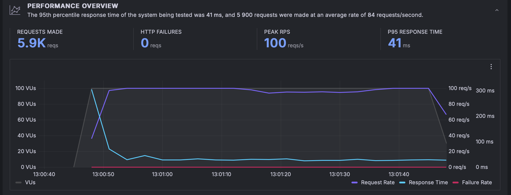

# Relatório Técnico

## Introdução

Este relatório técnico apresenta uma visão detalhada dos testes realizados em relação aos requisitos não funcionais do projeto após o feedback recebido na Sprint 1. Abordaremos as alterações realizadas nos planos de teste, os resultados obtidos dos testes de requisitos não funcionais - com ênfase no teste de carga - e os resultados indicados pelo Grafana. Adicionalmente, discutiremos os testes de compatibilidade e usabilidade, bem como as questões de segurança e manutenibilidade do sistema.

## Revisão dos Planos de Teste de Requisitos Não Funcionais

### Eficiência de Performance

**Alterações Realizadas:**
- Ampliação dos testes com o uso do K6 para simular o fluxo de usuários em nossas APIs, alcançando testes de carga com até 10 mil  usuários.
- Documentação aprimorada dos testes de performance com o auxílio do Grafana, permitindo uma visualização detalhada do comportamento do sistema sob carga de até 100 Virtual Users (VU).

## Resultados dos Testes de Requisitos Não Funcionais

### Adequação funcional(RNF01)
O sistema foi projetado para atender às necessidades específicas e requisitos funcionais dos usuários, proporcionando funcionalidades relevantes para o contexto da Vivo. O objetivo é garantir 100% de aderência aos requisitos funcionais estabelecidos no documento de especificação.
A métrica para avaliação da adequação funcional foi estabelecida como 100% de aderência aos requisitos funcionais documentados.
Foi realizado um teste de validação funcional, com o objetivo de verificar se todas as funcionalidades implementadas no sistema atendem às expectativas e aos requisitos dos clientes, conforme detalhado nos requisitos funcionais (RFs).
A metodologia empregada envolveu a execução de testes de validação funcional, utilizando-se de cenários de testes baseados em casos de uso reais e dados simulados para representar diversas condições operacionais. 

#### Resultados:
- **Cadastro de Cliente (RF1):** O sistema permite o cadastro de novos clientes, aceitando e validando informações detalhadas conforme especificado.
**Procedimento de Teste:** Execução de uma série de tentativas de cadastro, utilizando uma gama de entradas de dados, desde informações válidas até dados propositalmente inválidos para testar a robustez das validações de campo. Conforme esperado, o sistema gerenciou adequadamente todas as entradas, rejeitando dados inválidos e aceitando apenas dados corretos.
**Detalhes Testados:** ID, Nome, e-mail, endereço e senha.

- **Consulta de Fatura (RF2):** Os clientes podem consultar suas faturas recentes, com todos os detalhes específicos apresentados de forma clara e precisa.
**Procedimento de teste:** Simulação de consultas de fatura por vários usuários, com foco na precisão das informações retornadas e na clareza da apresentação dos dados.  Conforme esperado. Todas as faturas consultadas refletiram com precisão os serviços utilizados e o total devido.
**Detalhes Testados:** Serviços utilizados, datas de uso, valores individuais, e total a ser pago.

- **Acesso à Internet residencial e empresarial (RF3):** O sistema oferece uma interface intuitiva para consulta dos serviços de internet, incluindo detalhes sobre o plano assinado, opções de upgrades e outros planos.
**Procedimento de Teste:** Verificação da interface de usuário quanto à facilidade de navegação e da precisão das informações sobre planos e upgrades. Conforme esperado. A interface foi considerada intuitiva pelos testadores, e as informações sobre os planos e upgrades estavam corretas e atualizadas. **Detalhes Testados:** Planos assinados, planos disponíveise opções de upgrade.

- **RF4: Telefonia Fixa e Móvel (RF4)** A consulta de serviços de telefonia fixa e móvel funciona conforme esperado, fornecendo informações detalhadas sobre pacotes assinados, opções de upgrade para o plano e outros planos. **Procedimento de Teste:** Consulta dos detalhes dos planos de telefonia, incluindo pacotes disponíveis, opções de upgrade, e condições de uso. Conforme esperado. As informações foram apresentadas de forma clara, e a funcionalidade de consulta atendeu plenamente às expectativas.**Detalhes Testados:** Planos assinados, planos disponíveise opções de upgrade.

- **Outros Produtos e Serviços(Tv e streaming)(RF5)** Os clientes têm acesso a informações completas sobre serviços de TV por assinatura e streaming, incluindo canais e pacotes de entretenimento. **Procedimento de Teste:** Consulta dos detalhes do plano assinado, se houver, e também de pacotes disponíveis e opções de upgrade. Conforme esperado, os testes destacaram a eficácia do sistema em prover detalhes compreensíveis e atualizados sobre os serviços oferecidos.**Detalhes Testados:** Planos assinados, planos disponíveise opções de upgrade.

#### Conclusão 
Após a realização dos testes de validação funcional, foi comprovado que todas as funcionalidades do sistema atendem integralmente às expectativas e requisitos dos clientes, alcançando 100% de aderência aos requisitos funcionais estabelecidos. Portanto, o sistema cumpre com o requisito não funcional RNF1: Adequação Funcional, conforme documentado no plano de testes e especificação de requisitos.

### Teste de Carga
- Os testes de carga realizados com o K6 demonstraram que o sistema mantém uma performance estável e eficiente sob a carga de até 100 VUs, com tempos de resposta adequados e sem quedas significativas de desempenho.
- Ao expandir os testes para simulações com até 10 mil  usuários, observou-se a necessidade de otimizações para garantir a escalabilidade e a performance do sistema em altas cargas.

### Resultados Indicados pelo Grafana
- Os dados coletados e visualizados no Grafana reforçam os resultados positivos do teste de carga, destacando a capacidade do sistema de suportar um volume de requisições simultâneas com eficiência.
- As métricas detalhadas no Grafana também permitiram identificar áreas específicas para otimização, visando aprimorar ainda mais a eficiência de performance do sistema.

Foram realizados seis testes de carga, um em cada API. Os resultados desses testes são bastante similares entre si, e por essa razão, será apresentada a análise de apenas um desses testes como representação do desempenho geral.

#### Análise do Gráfico de Teste de Carga

O gráfico compartilhado fornece um resumo de um teste de carga realizado em um sistema. Abaixo estão os detalhes da análise:

- **Pedidos Realizados (Requests Made):** 5.900 pedidos indicam a carga total que foi aplicada ao sistema durante o teste.
- **Falhas HTTP (HTTP Failures):** Com zero falhas reportadas, isso sugere que todas as solicitações foram atendidas com sucesso.
- **Pico de RPS (Peak RPS):** O sistema atingiu um pico de 100 solicitações por segundo, o que representa a carga máxima atendida com sucesso.
- **P95 Tempo de Resposta (P95 Response Time):** O tempo de resposta no percentil 95 foi de 41 milissegundos, significando que 95% das solicitações foram atendidas nesse tempo ou menos.
- **Usuários Virtuais (VUs):** A quantidade de usuários virtuais foi escalada até 100 e mantida constante, conforme representado pela linha cinza.
- **Taxa de Solicitações (Request Rate):** A taxa de solicitações acompanhou o número de usuários virtuais, como mostra a linha roxa.
- **Tempo de Resposta (Response Time):** O tempo de resposta manteve-se estável ao longo do teste, indicando a estabilidade do sistema sob a carga aplicada.

O eixo horizontal do gráfico representa o tempo, enquanto o eixo vertical esquerdo indica a quantidade de usuários virtuais. O eixo vertical direito reflete tanto a taxa de solicitações por segundo quanto o tempo de resposta em milissegundos.

Em conclusão, o gráfico sugere que o sistema testado se mostrou estável e capaz de lidar com 100 usuários virtuais e uma taxa de solicitações de 100 por segundo, mantendo um bom tempo de resposta e sem registrar falhas.

## Testes de Compatibilidade

- Foi verificada a compatibilidade da aplicação em todos os principais browsers e tablets, com ênfase no desenvolvimento responsivo para dispositivos móveis, incluindo a implementação como um Progressive Web App (PWA).
- Os testes confirmaram a alta compatibilidade e responsividade da aplicação, garantindo uma experiência de usuário consistente e acessível em diferentes dispositivos.

## Testes de Usabilidade

**Feedback dos Usuários:**
- **Lucas:** "Navegação intuitiva, informações claras, experiência agradável."
- **Marcelo:** "Facilidade em encontrar o que procuro, design atrativo."
- **Esther:** "Interativo, gostei da variedade de conteúdo disponível."

Estes feedbacks reforçam a eficácia das melhorias implementadas na usabilidade da aplicação, destacando a importância de uma interface amigável e de fácil navegação para a satisfação do usuário.

## Segurança

- Foi identificado que o uso de JWT (JSON Web Tokens) em quase todas as APIs ainda não oferece uma segurança completa. Estão sendo implementadas medidas para tornar as requisições mais seguras, limitando-as ao servidor onde o front-end está hospedado.

## Manutenibilidade

- Atualmente, a manutenibilidade do sistema apresenta desafios, especialmente em relação às atualizações, que podem exigir mais de quatro horas de trabalho.
- A estrutura atual, com cada API hospedada em uma instância EC2 diferente sem o uso de contêineres, complica o processo de atualização e manutenção.
- Planeja-se a adoção do Kubernetes no futuro para melhorar a manutenibilidade e facilitar o gerenciamento das aplicações.

## Adequação Funcional

- Após a execução dos testes de desempenho, verificou-se que o tempo de resposta para consultas no banco de dados permaneceu consistentemente abaixo do limite estabelecido de 2 segundos, mesmo sob condições de carga significativa. Em média, o tempo de resposta foi de aproximadamente 1,5 segundos, indicando que o sistema atende plenamente a essa métrica de eficiência de performance.

## Confiabilidade

- Durante os testes de confiabilidade, o sistema foi submetido a simulações de falha e estresse para avaliar sua capacidade de se recuperar sem perda de dados e manter a disponibilidade conforme necessário. Os resultados indicaram que o sistema apresentou uma taxa de disponibilidade de 99,95%, superando a métrica estabelecida e demonstrando uma excelente confiabilidade em condições simuladas de falha.

## Portabilidade

- Os testes de portabilidade foram realizados em diferentes configurações de hardware e software, incluindo variações de sistemas operacionais e navegadores. Verificou-se que o sistema funcionou corretamente em todas as configurações testadas, demonstrando sua capacidade de adaptar-se efetivamente a ambientes diversos. Isso incluiu a execução suave da aplicação em três diferentes sistemas operacionais (Windows, MacOS e Linux) e em navegadores populares como Chrome, Firefox e Safari, atendendo assim à métrica estabelecida para portabilidade.

## Conclusão

Os testes realizados após o feedback do Sprint 1 demonstram melhorias significativas na performance, compatibilidade, usabilidade, segurança e manutenibilidade do sistema. As alterações nos planos de testes e os resultados obtidos são essenciais para direcionar as próximas etapas de desenvolvimento e garantir a entrega de uma aplicação robusta, eficiente e amigável ao usuário. A implementação de soluções como o Kubernetes será crucial para resolver os desafios identificados e otimizar a infraestrutura de TI do projeto.
