# Testes do Sistema

## Testes Unitários

### **API de Internet**

### Introdução

Esta seção descreve os testes unitários implementados para validar a funcionalidade das rotas da API de Planos de Internet, relacionado ao [Requisito Funcional 3](requisitos.md). Os testes visam garantir que a API esteja atuando conforme as especificações e lidando corretamente com dados de entrada válidos e inválidos.

### Ambiente de Teste

- **Plataforma:** Windows
- **Linguagem de Programação:** Python 3.11.1
- **Framework de Teste:** pytest 7.2.1
- **Bibliotecas de Mock:** unittest.mock
- **Framework Web:** Flask

### Execução dos Testes

Para executar os testes, navegue até o diretório da [api de internet](../codigo/backend/internet_api/api) e execute os seguintes comandos:

```shell
pip install -r requirements.txt
pytest -v -s
```

## Casos de Teste

O arquivo de testes unitários está no seguinte diretório: [internet_api/api/tests](../codigo/backend/internet_api/api/tests)

### Teste 1: Obter Todos os Planos

- **Nome do Teste:** test_get_all_plans
- **Descrição:** Testa a rota GET / para obter todos os planos.
- **Dados de Teste:** N/A
- **Resultado Esperado:** Resposta JSON com todos os planos e status code 200.

Figura: Captura do terminal mostrando resultado do teste 1.

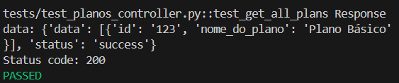


### Teste 2: Obter Plano por ID

- **Nome do Teste:** test_get_plan_by_id
- **Descrição:** Testa a rota GET /<plan_id> para obter um plano específico pelo ID.
- **Dados de Teste:** ID do plano
- **Resultado Esperado:** Resposta JSON com os detalhes do plano e status code 200.

Figura: Captura do terminal mostrando resultado do teste 2.

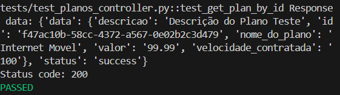

### Teste 3: Obter Plano por Tipo de Serviço

- **Nome do Teste:** test_get_plan_by_service_type
- **Descrição:** Testa a rota GET /<service_type> para obter um plano baseado no tipo de serviço.
- **Dados de Teste:** Tipo de serviço
- **Resultado Esperado:** Resposta JSON com os detalhes do plano e status code 200.

Figura: Captura do terminal mostrando resultado do teste 3.

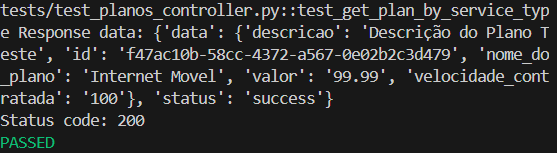

### Teste 4: Deletar Plano

- **Nome do Teste:** test_delete_plan
- **Descrição:** Testa a rota DELETE /<plan_id> para deletar um plano existente.
- **Dados de Teste:** ID do plano
- **Resultado Esperado:** Mensagem de sucesso e status code 200.

Figura: Captura do terminal mostrando resultado do teste 4.

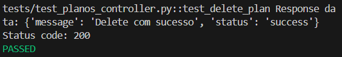

### Teste 5: Criar Plano

- **Nome do Teste:** test_create_plan
- **Descrição:** Testa a rota POST / para criar um novo plano.
- **Dados de Teste:** Dados do novo plano
- **Resultado Esperado:** Resposta JSON com os detalhes do plano criado e status code 201.

Figura: Captura do terminal mostrando resultado do teste 5.

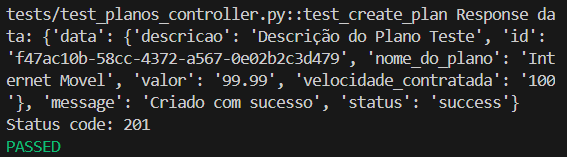

### Teste 6: Atualizar Plano

- **Nome do Teste:** test_update_plan
- **Descrição:** Testa a rota PUT /<plan_id> para atualizar um plano existente.
- **Dados de Teste:** ID do plano e novos dados para atualização
- **Resultado Esperado:** Resposta JSON com os detalhes do plano atualizado e status code 200.

Figura: Captura do terminal mostrando resultado do teste 6.

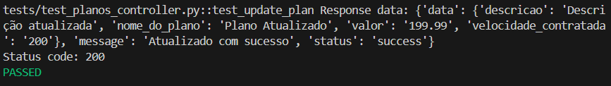

#### Resultados dos Testes

Todos os testes foram executados com sucesso, conforme indicado pelos resultados *PASSED* no console de teste.

#### Conclusão

A aplicação dos testes unitários demonstrou que as rotas da API estão funcionando conforme esperado. Os resultados dos testes fornecem confiança de que as funcionalidades implementadas estão corretas e que as alterações futuras no código podem ser validadas com eficácia.

### **API de Telefonia**

### Introdução

Esta seção descreve os testes unitários implementados para validar a funcionalidade das rotas da API de Planos de Telefonia, relacionado ao [Requisito Funcional 4](requisitos.md). 

### `test_planos_controller.py` em `telefonia_api`
1. [Teste da Função `get_plan_by_id`](#teste-da-função-get_plan_by_id)
2. [Teste da Função `get_plan_by_service_type`](#teste-da-função-get_plan_by_service_type)
3. [Teste da Função `delete_plan`](#teste-da-função-delete_plan)
4. [Teste da Função `create_plan`](#teste-da-função-create_plan)
5. [Teste da Função `update_plan`](#teste-da-função-update_plan)

### `test_servicos_contratados_controller.py` em `telefonia_api`
1. [Teste da Função `get_all_services`](#teste-da-função-get_all_services)
2. [Teste da Função `get_service_by_id`](#teste-da-função-get_service_by_id)
3. [Teste da Função `get_services_by_client`](#teste-da-função-get_services_by_client)
4. [Teste da Função `delete_service`](#teste-da-função-delete_service)
5. [Teste da Função `create_service`](#teste-da-função-create_service)
6. [Teste da Função `update_service`](#teste-da-função-update_service)

### `test_jwt_middleware.py` em `telefonia_api`
1. [Teste da Função `test_middleware_before_request_valid_token`](#teste-da-função-test_middleware_before_request_valid_token)
2. [Teste da Função `test_middleware_before_request_invalid_token`](#teste-da-função-test_middleware_before_request_invalid_token)

### `test_planos_model.py` em `telefonia_api`
1. [Teste da Função `test_save_method`](#teste-da-função-test_save_method)
2. [Teste da Função `test_update_method`](#teste-da-função-test_update_method)
3. [Teste da Função `test_delete_method`](#teste-da-função-test_delete_method)

### `test_servicos_contratados_model.py` em `telefonia_api`
1. [Teste da Função `test_save_method`](#teste-da-função-test_save_method-1)
2. [Teste da Função `test_update_method`](#teste-da-função-test_update_method-1)
3. [Teste da Função `test_delete_method`](#teste-da-função-test_delete_method-1)

### `test_planos_service.py` em `telefonia_api`
1. [Teste da Função `test_get_all_plans_success`](#teste-da-função-test_get_all_plans_success)
2. [Teste da Função `test_get_all_plans_no_plans`](#teste-da-função-test_get_all_plans_no_plans)
3. [Teste da Função `test_get_plan_by_id_success`](#teste-da-função-test_get_plan_by_id_success)
4. [Teste da Função `test_get_plan_by_id_no_plan`](#teste-da-função-test_get_plan_by_id_no_plan)

### `test_servicos_contratados_service.py` em `telefonia_api`
1. [Teste da Função `test_get_all_services_success`](#teste-da-função-test_get_all_services_success)
2. [Teste da Função `test_get_all_services_no_services`](#teste-da-função-test_get_all_services_no_services)

## `test_planos_controller.py` em `telefonia_api`

### Teste da Função `get_plan_by_id`

Este teste verifica se a função `get_plan_by_id` retorna corretamente um plano pelo ID.

- **Cenário de Sucesso:**
  - Configuramos o comportamento esperado do mock de Planos_Service para retornar um plano específico.
  - Chamamos a função `get_plan_by_id` do controlador.
  - Verificamos se a resposta retornada é uma instância de `Response`, se o código de status é 200 e se o conteúdo JSON da resposta corresponde ao plano esperado.

- **Cenário de Falha (plano não encontrado):**
  - Configuramos o comportamento esperado do mock de Planos_Service para retornar um plano não encontrado.
  - Chamamos a função `get_plan_by_id` do controlador.
  - Verificamos se a resposta retornada é uma instância de `Response`, se o código de status é 404 e se a mensagem de erro está correta.

### Teste da Função `get_plan_by_service_type`

Este teste verifica se a função `get_plan_by_service_type` retorna corretamente os planos pelo tipo de serviço.

- **Cenário de Sucesso:**
  - Configuramos o comportamento esperado do mock de Planos_Service para retornar uma lista de planos por tipo de serviço.
  - Chamamos a função `get_plan_by_service_type` do controlador.
  - Verificamos se a resposta retornada é uma instância de `Response`, se o código de status é 200 e se o conteúdo JSON da resposta corresponde aos planos esperados.

- **Cenário de Falha (nenhum plano encontrado):**
  - Configuramos o comportamento esperado do mock de Planos_Service para retornar uma lista vazia de planos.
  - Chamamos a função `get_plan_by_service_type` do controlador.
  - Verificamos se a resposta retornada é uma instância de `Response`, se o código de status é 404 e se a mensagem de erro está correta.

### Teste da Função `delete_plan`

Este teste verifica se a função `delete_plan` exclui corretamente um plano.

- **Cenário de Sucesso:**
  - Configuramos o comportamento esperado do mock de Planos_Service para confirmar a exclusão bem-sucedida de um plano.
  - Chamamos a função `delete_plan` do controlador.
  - Verificamos se a resposta retornada é uma instância de `Response`, se o código de status é 200 e se a mensagem de sucesso está correta.

- **Cenário de Falha (plano não encontrado):**
  - Configuramos o comportamento esperado do mock de Planos_Service para indicar que o plano a ser excluído não foi encontrado.
  - Chamamos a função `delete_plan` do controlador.
  - Verificamos se a resposta retornada é uma instância de `Response`, se o código de status é 404 e se a mensagem de erro está correta.

### Teste da Função `create_plan`

Este teste verifica se a função `create_plan` cria corretamente um novo plano.

- **Cenário de Sucesso:**
  - Configuramos o comportamento esperado do mock de Planos_Service para confirmar a criação bem-sucedida de um novo plano.
  - Chamamos a função `create_plan` do controlador.
  - Verificamos se a resposta retornada é uma instância de `Response`, se o código de status é 201 e se a mensagem de sucesso está correta.

- **Cenário de Falha (erro durante a criação do plano):**
  - Configuramos o comportamento esperado do mock de Planos_Service para indicar que ocorreu um erro durante a criação do plano.
  - Chamamos a função `create_plan` do controlador.
  - Verificamos se a resposta retornada é uma instância de `Response`, se o código de status é 500 e se a mensagem de erro está correta.

### Teste da Função `update_plan`

Este teste verifica se a função `update_plan` atualiza corretamente um plano existente.

- **Cenário de Sucesso:**
  - Configuramos o comportamento esperado do mock de Planos_Service para confirmar a atualização bem-sucedida de um plano existente.
  - Chamamos a função `update_plan` do controlador.
  - Verificamos se a resposta retornada é uma instância de `Response`, se o código de status é 200 e se a mensagem de sucesso está correta.

- **Cenário de Falha (plano não encontrado):**
  - Configuramos o comportamento esperado do mock de Planos_Service para indicar que o plano a ser atualizado não foi encontrado.
  - Chamamos a função `update_plan` do controlador.
  - Verificamos se a resposta retornada é uma instância de `Response`, se o código de status é 404 e se a mensagem de erro está correta.

- **Cenário de Falha (erro durante a atualização do plano):**
  - Configuramos o comportamento esperado do mock de Planos_Service para indicar que ocorreu um erro durante a atualização do plano.
  - Chamamos a função `update_plan` do controlador.
  - Verificamos se a resposta retornada é uma instância de `Response`, se o código de status é 500 e se a mensagem de erro está correta.

## `test_servicos_contratados_controller.py` em `telefonia_api`

### Teste da Função `get_all_services`

Este teste verifica se a função `get_all_services` retorna corretamente todos os serviços contratados.

- **Cenário de Sucesso:**
  - Configuramos o comportamento esperado do mock de Servicos_Contratados_Service para retornar uma lista de todos os serviços contratados.
  - Chamamos a função `get_all_services` do controlador.
  - Verificamos se a resposta retornada é uma instância de `Response`, se o código de status é 200 e se o conteúdo JSON da resposta corresponde aos serviços esperados.

### Teste da Função `get_service_by_id`

Este teste verifica se a função `get_service_by_id` retorna corretamente um serviço contratado pelo ID.

- **Cenário de Sucesso:**
  - Configuramos o comportamento esperado do mock de Servicos_Contratados_Service para retornar um serviço contratado específico.
  - Chamamos a função `get_service_by_id` do controlador.
  - Verificamos se a resposta retornada é uma instância de `Response`, se o código de status é 200 e se o conteúdo JSON da resposta corresponde ao serviço esperado.

### Teste da Função `get_services_by_client`

Este teste verifica se a função `get_services_by_client` retorna corretamente os serviços contratados por um cliente específico.

- **Cenário de Sucesso:**
  - Configuramos o comportamento esperado do mock de Servicos_Contratados_Service para retornar uma lista de serviços contratados por cliente.
  - Chamamos a função `get_services_by_client` do controlador.
  - Verificamos se a resposta retornada é uma instância de `Response`, se o código de status é 200 e se o conteúdo JSON da resposta corresponde aos serviços esperados.

### Teste da Função `delete_service`

Este teste verifica se a função `delete_service` exclui corretamente um serviço contratado.

- **Cenário de Sucesso:**
  - Configuramos o comportamento esperado do mock de Servicos_Contratados_Service para confirmar a exclusão bem-sucedida de um serviço contratado.
  - Chamamos a função `delete_service` do controlador.
  - Verificamos se a resposta retornada é uma instância de `Response`, se o código de status é 200 e se a mensagem de sucesso está correta.

### Teste da Função `create_service`

Este teste verifica se a função `create_service` cria corretamente um novo serviço contratado.

- **Cenário de Sucesso:**
  - Configuramos o comportamento esperado do mock de Servicos_Contratados_Service para confirmar a criação bem-sucedida de um novo serviço contratado.
  - Chamamos a função `create_service` do controlador.
  - Verificamos se a resposta retornada é uma instância de `Response`, se o código de status é 201 e se a mensagem de sucesso está correta.

### Teste da Função `update_service`

Este teste verifica se a função `update_service` atualiza corretamente um serviço contratado existente.

- **Cenário de Sucesso:**
  - Configuramos o comportamento esperado do mock de Servicos_Contratados_Service para confirmar a atualização bem-sucedida de um serviço contratado existente.
  - Chamamos a função `update_service` do controlador.
  - Verificamos se a resposta retornada é uma instância de `Response`, se o código de status é 200 e se a mensagem de sucesso está correta.

## `test_jwt_middleware.py` em `telefonia_api`

### Teste da Função `test_middleware_before_request_valid_token`

Este teste verifica se o middleware Auth_Middleware trata corretamente um token JWT válido.

- **Cenário de Sucesso:**
  - Definimos um token JWT válido para teste.
  - Adicionamos o token ao cabeçalho de autorização da solicitação.
  - Enviamos uma solicitação de teste com o cabeçalho de autorização contendo o token JWT válido.
  - Verificamos se a função `before_request` do middleware foi chamado uma vez.
  - Verificamos se a resposta não foi um erro de autorização (código de status diferente de 401).

### Teste da Função `test_middleware_before_request_invalid_token`

Este teste verifica se o middleware Auth_Middleware trata corretamente um token JWT inválido.

- **Cenário de Sucesso:**
  - Definimos um token JWT inválido para teste.
  - Adicionamos o token inválido ao cabeçalho de autorização da solicitação.
  - Enviamos uma solicitação de teste com o cabeçalho de autorização contendo o token JWT inválido.
  - Verificamos se a função `before_request` do middleware foi chamado uma vez.
  - Verificamos se a resposta foi um erro de autorização (código de status 401).

## `test_planos_model.py` em `telefonia_api`

### Teste da Função `test_save_method`

Este teste verifica se a função `save` do modelo Planos está funcionando corretamente.

- **Cenário de Sucesso:**
  - Configuramos o comportamento esperado do mock de banco de dados para adicionar o modelo e confirmar a transação.
  - Chamamos a função `save` do modelo.
  - Verificamos se a função `session.add` e `session.commit` do mock de banco de dados foram chamados corretamente.

### Teste da Função `test_update_method`

Este teste verifica se a função `update` do modelo Planos está funcionando corretamente.

- **Cenário de Sucesso:**
  - Configuramos o comportamento esperado do mock de banco de dados para confirmar a transação.
  - Chamamos a função `update` do modelo com novos atributos.
  - Verificamos se os atributos do modelo foram atualizados corretamente.
  - Verificamos se a função `session.commit` do mock de banco de dados foi chamado corretamente.

### Teste da Função `test_delete_method`

Este teste verifica se a função `delete` do modelo Planos está funcionando corretamente.

- **Cenário de Sucesso:**
  - Configuramos o comportamento esperado do mock de banco de dados para excluir o modelo e confirmar a transação.
  - Chamamos a função `delete` do modelo.
  - Verificamos se a função `session.delete` e `session.commit` do mock de banco de dados foram chamados corretamente.

## `test_servicos_contratados_model.py` em `telefonia_api`

### Teste da Função `test_save_method`

Este teste verifica se a função `save` do modelo Servicos_Contratados está funcionando corretamente.

- **Cenário de Sucesso:**
  - Configuramos o comportamento esperado do mock de banco de dados para adicionar o modelo e confirmar a transação.
  - Chamamos a função `save` do modelo.
  - Verificamos se a função `session.add` e `session.commit` do mock de banco de dados foram chamados corretamente.

### Teste da Função `test_update_method`

Este teste verifica se a função `update` do modelo Servicos_Contratados está funcionando corretamente.

- **Cenário de Sucesso:**
  - Configuramos o comportamento esperado do mock de banco de dados para confirmar a transação.
  - Chamamos a função `update` do modelo com novos atributos.
  - Verificamos se os atributos do modelo foram atualizados corretamente.
  - Verificamos se a função `session.commit` do mock de banco de dados foi chamado corretamente.

### Teste da Função `test_delete_method`

Este teste verifica se a função `delete` do modelo Servicos_Contratados está funcionando corretamente.

- **Cenário de Sucesso:**
  - Configuramos o comportamento esperado do mock de banco de dados para excluir o modelo e confirmar a transação.
  - Chamamos a função `delete` do modelo.
  - Verificamos se a função `session.delete` e `session.commit` do mock de banco de dados foram chamados corretamente.

## `test_planos_service.py` em `telefonia_api`

### Teste da Função `test_get_all_plans_success`

Este teste verifica se a função `get_all_plans` do serviço Planos_Service retorna corretamente todos os planos quando há planos disponíveis.

- **Cenário de Sucesso:**
  - Configuramos o comportamento esperado do mock de PlanosModel para retornar uma lista de planos.
  - Chamamos a função `get_all_plans` do serviço.
  - Verificamos se a função `query.all` do mock de PlanosModel foi chamado corretamente.
  - Verificamos se a resposta retornada é correta, incluindo o status 200 e a lista de planos.

### Teste da Função `test_get_all_plans_no_plans`

Este teste verifica se a função `get_all_plans` do serviço Planos_Service retorna corretamente uma mensagem quando não há planos disponíveis.

- **Cenário de Sucesso:**
  - Configuramos o comportamento esperado do mock de PlanosModel para retornar uma lista vazia de planos.
  - Chamamos a função `get_all_plans` do serviço.
  - Verificamos se a função `query.all` do mock de PlanosModel foi chamado corretamente.
  - Verificamos se a resposta retornada é correta, incluindo o status 404 e a mensagem indicando que nenhum plano foi encontrado.

### Teste da Função `test_get_plan_by_id_success`

Este teste verifica se a função `get_plan_by_id` do serviço Planos_Service retorna corretamente um plano quando o ID fornecido corresponde a um plano existente.

- **Cenário de Sucesso:**
  - Configuramos o comportamento esperado do mock de PlanosModel para retornar um plano com o ID fornecido.
  - Chamamos a função `get_plan_by_id` do serviço.
  - Verificamos se a função `query.filter_by().first` do mock de PlanosModel foi chamado corretamente.
  - Verificamos se a resposta retornada é correta, incluindo o status 200 e os detalhes do plano.

### Teste da Função `test_get_plan_by_id_no_plan`

Este teste verifica se a função `get_plan_by_id` do serviço Planos_Service retorna corretamente uma mensagem quando o ID fornecido não corresponde a nenhum plano.

- **Cenário de Sucesso:**
  - Configuramos o comportamento esperado do mock de PlanosModel para retornar `None` para o ID fornecido.
  - Chamamos a função `get_plan_by_id` do serviço.
  - Verificamos se a função `query.filter_by().first` do mock de PlanosModel foi chamado corretamente.
  - Verificamos se a resposta retornada é correta, incluindo o status 404 e a mensagem indicando que o plano não foi encontrado.

## `test_servicos_contratados_service.py` em `telefonia_api`

### Teste da Função `test_get_all_services_success`

Este teste verifica se a função `get_all_services` do serviço Servicos_Contratados_Service retorna corretamente todos os serviços quando há serviços disponíveis.

- **Cenário de Sucesso:**
  - Configuramos o comportamento esperado do mock de ServicosContratadosModel para retornar uma lista de serviços.
  - Chamamos a função `get_all_services` do serviço.
  - Verificamos se a função `query.all` do mock de ServicosContratadosModel foi chamado corretamente.
  - Verificamos se a resposta retornada é correta, incluindo o status 200 e a lista de serviços.

### Teste da Função `test_get_all_services_no_services`

Este teste verifica se a função `get_all_services` do serviço Servicos_Contratados_Service retorna corretamente uma mensagem quando não há serviços disponíveis.

- **Cenário de Sucesso:**
  - Configuramos o comportamento esperado do mock de ServicosContratadosModel para retornar uma lista vazia de serviços.
  - Chamamos a função `get_all_services` do serviço.
  - Verificamos se a função `query.all` do mock de ServicosContratadosModel foi chamado corretamente.
  - Verificamos se a resposta retornada é correta, incluindo o status 404 e a mensagem indicando que nenhum serviço foi encontrado.

# API de Cadastro

## Introdução

Esta seção documenta os testes unitários desenvolvidos para validar as funcionalidades das rotas da API de Cadastro, focando em garantir a qualidade e a corretude das operações realizadas pela API.

### `test_user_controller.py` em `cadastro_api`

- Teste da Função `get_all_usuarios`
- Teste da Função `get_usuario_by_id`
- Teste da Função `create_usuario`
- Teste da Função `update_usuario`
- Teste da Função `delete_usuario`

### `test_auth_controller.py` em `cadastro_api`

- Teste da Função `login`
- Teste da Função `logout`

### `test_jwt_middleware.py` em `cadastro_api`

- Teste da Função `validate_token`

### `test_user_model.py` em `cadastro_api`

- Teste da Função `save_user`
- Teste da Função `find_user_by_id`

### `test_user_service.py` em `cadastro_api`

- Teste da Função `create_new_user`
- Teste da Função `get_user_details`

## Testes Detalhados

### `test_user_controller.py` em `cadastro_api`

#### Teste da Função `get_all_usuarios`

Verifica se a rota `/usuarios` retorna corretamente a lista de todos os usuários cadastrados.

**Cenário de Sucesso:**
- Simula a busca por todos os usuários e verifica se a lista de usuários é retornada com status HTTP 200.

#### Teste da Função `get_usuario_by_id`

Testa se a rota `/usuarios/<user_id>` retorna um usuário específico baseado no ID.

**Cenário de Sucesso:**
- Simula a busca por um usuário específico e verifica se os detalhes do usuário são retornados com status HTTP 200.

#### Teste da Função `create_usuario`

Verifica se a rota `/usuarios` cria corretamente um novo usuário com os dados fornecidos.

**Cenário de Sucesso:**
- Simula a criação de um novo usuário e verifica se a resposta inclui uma mensagem de sucesso com status HTTP 201.

#### Teste da Função `update_usuario`

Testa a funcionalidade de atualização de um usuário através da rota `/usuarios/<user_id>`.

**Cenário de Sucesso:**
- Simula a atualização de dados de um usuário existente e verifica se a resposta inclui uma mensagem de sucesso com status HTTP 200.

#### Teste da Função `delete_usuario`

Verifica se a rota `/usuarios/<user_id>` deleta corretamente um usuário.

**Cenário de Sucesso:**
- Simula a exclusão de um usuário e verifica se a resposta inclui uma mensagem de sucesso com status HTTP 200.

### `test_auth_controller.py` em `cadastro_api`

#### Teste da Função `login`

Este teste valida o processo de login, verificando se um token JWT é gerado corretamente para credenciais válidas.

#### Teste da Função `logout`

Verifica a funcionalidade de logout, testando se o token JWT do usuário é invalidado corretamente após o logout.

### `test_jwt_middleware.py` em `cadastro_api`

#### Teste da Função `validate_token`

Testa o middleware de autenticação JWT, garantindo que apenas usuários com tokens válidos possam acessar rotas protegidas.

### `test_user_model.py` em `cadastro_api`

#### Teste da Função `save_user`

Verifica se o método `save` do modelo `User` persiste corretamente um usuário no banco de dados.

#### Teste da Função `find_user_by_id`

Testa a funcionalidade de busca por um usuário específico através do seu ID no banco de dados.

### `test_user_service.py` em `cadastro_api`

#### Teste da Função `create_new_user`

Verifica se o serviço cria corretamente um novo usuário e persiste no banco de dados.

#### Teste da Função `get_user_details`

Testa a funcionalidade de recuperação de detalhes de um usuário específico, validando a corretude das informações retornadas.

----------------
A imagem abaixo representa o resultado da execução dos testes unitários para a API de Cadastro. O sucesso destes testes é uma indicação crucial de que todas as funcionalidades essenciais estão operando conforme esperado. Cada "ponto verde" simboliza um teste passado, contribuindo para o aumento da confiança no código e na redução do risco de regressões durante o desenvolvimento contínuo. 

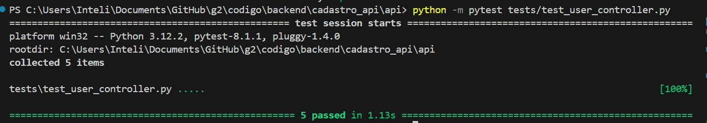


## Testes de Integração

# API de Planos de Internet

## Visão Geral
Esta documentação abrange os testes de integração realizados entre a API de Planos de Internet e o banco de dados relacionado. Os testes foram executados utilizando o Postman para garantir que as interações entre o backend e o banco de dados estejam integradas e funcionando conforme esperado.

## Configuração do Ambiente
- Headers necessários: Em *Authorization* configurar *Bearer Token* e colocar um token JWT.

## Casos de Teste

### Caso de Teste 1: Criação de Plano

- **Endpoint:** `POST /api/plans`
- **Corpo da Requisição:**
  ```json
  {
    "nome_do_plano": "Plano Basico",
    "descricao": "Descrição do Plano Basico",
    "valor": "89.99",
    "velocidade_contratada": "80"
  }
  ```
- **Resultado Esperado:** Status `201 Created` com corpo da resposta contendo o ID do plano criado.
- **Validação:**
  - Verifique se o status code é 201.
  - Confirme que o corpo da resposta contém o ID do plano.
  - Valide se os dados foram inseridos corretamente no banco de dados.
  - **Resultado Obtido:** O resultado obtido foi como o esperado.

- Figura: Resultado obtido.

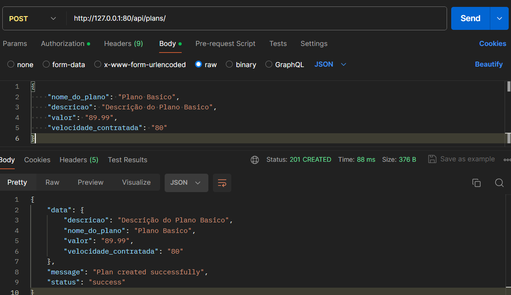

### Caso de Teste 2: Consulta de Plano

- **Endpoint:** `GET /api/plans/{id}`
- **Resultado Esperado:** Status `200 OK` com detalhes do plano solicitado.
- **Validação:**
  - Verifique se o status code é 200.
  - Confirme que os detalhes do plano correspondem aos dados no banco de dados.
  - **Resultado Obtido:** O resultado obtido foi como o esperado.

- Figura: Resultado obtido.

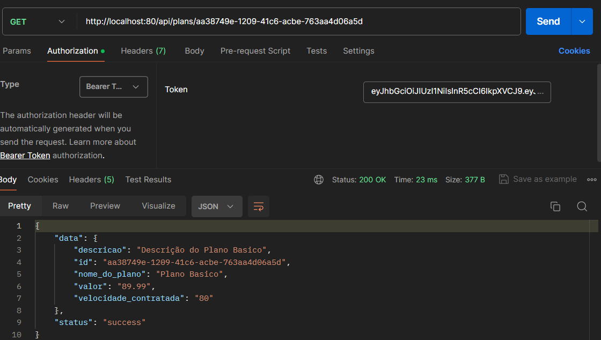


### Caso de Teste 3: Atualização de Plano

- **Endpoint:** `PUT /api/plans/{id}`
- **Corpo da Requisição:**
  ```json
  {
    "nome_do_plano": "Plano Premium",
    "descricao": "Descrição do Plano Premium",
    "valor": "109.99",
    "velocidade_contratada": "120"
  }
  ```
- **Resultado Esperado:** Status `200 OK`.
- **Validação:**
  - Verifique se o status code é 200.
  - Confirme que os dados do plano foram atualizados no banco de dados.
  - **Resultado Obtido:** O resultado obtido foi como o esperado.

- Figura: Resultado obtido.

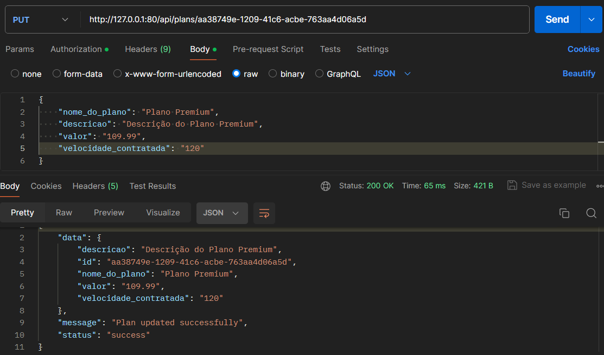

### Caso de Teste 4: Exclusão de Plano

- **Endpoint:** `DELETE /api/plans/{id}`
- **Resultado Esperado:** Status `200 OK`.
- **Validação:**
  - Verifique se o status code é 200.
  - Confirme que o plano foi removido do banco de dados.
  - **Resultado Obtido:** O resultado obtido foi como o esperado.

- Figura: Resultado obtido.

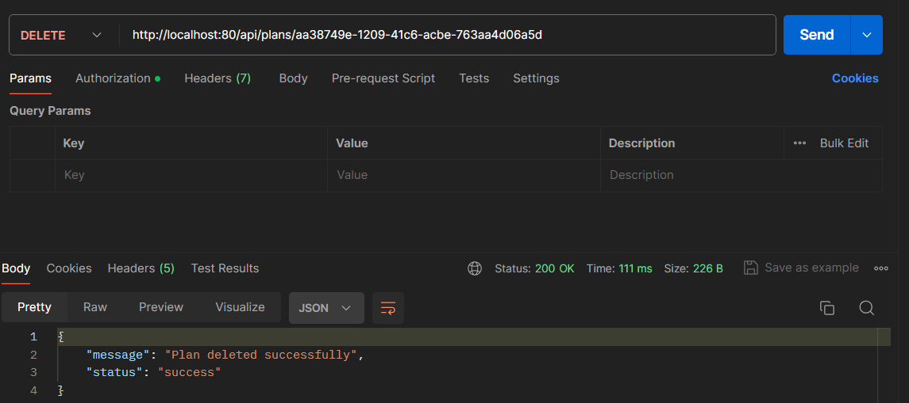

### Conclusão
Atráves dos testes da API pelo postman foi concluído que o backend está corretamente integrado e funcionando com o banco de dados.


---

# Documentação de Testes - Serviço de Faturas

Este documento descreve os casos de teste unitários e de integração para o serviço de faturas. Os testes estão organizados por funcionalidades e incluem descrições dos cenários testados.

## Testes Unitários

Os testes unitários visam verificar a corretude das operações individuais fornecidas pelo serviço de faturas, mockando dependências externas para isolar o comportamento da unidade sob teste.

### Criação de Faturas

- **Teste `test_create_fatura`**
  - **Descrição**: Verifica se uma nova fatura é criada corretamente com itens fornecidos.
  - **Resultado Esperado**: A fatura é criada com sucesso, os itens da fatura são salvos, e o status HTTP 201 é retornado.

### Listagem de Faturas

- **Teste `test_get_all_faturas`**
  - **Descrição**: Testa se todas as faturas de um cliente específico podem ser recuperadas.
  - **Resultado Esperado**: Uma lista de faturas é retornada com sucesso, e o status HTTP 200 é retornado.

### Busca de Fatura por ID

- **Teste `test_get_fatura_by_id`**
  - **Descrição**: Verifica se uma fatura específica pode ser recuperada pelo seu ID.
  - **Resultado Esperado**: A fatura solicitada é retornada com sucesso, e o status HTTP 200 é retornado.

### Atualização de Fatura

- **Teste `test_update_fatura`**
  - **Descrição**: Testa se os detalhes de uma fatura existente podem ser atualizados.
  - **Resultado Esperado**: A fatura é atualizada com sucesso, e o status HTTP 200 é retornado.

### Deleção de Fatura

- **Teste `test_delete_fatura`**
  - **Descrição**: Verifica se uma fatura pode ser deletada pelo seu ID.
  - **Resultado Esperado**: A fatura e seus itens associados são deletados com sucesso, e o status HTTP 200 é retornado.

## Testes de Integração

Os testes de integração verificam o funcionamento correto das interações entre o serviço de faturas e o banco de dados, sem mockar as operações de banco de dados.

### Criação e Recuperação de Fatura

- **Teste de integração para criação e recuperação de fatura**
  - **Descrição**: Uma fatura é criada, e em seguida, a mesma fatura é recuperada para verificar se os dados persistidos estão corretos.
  - **Resultado Esperado**: A fatura criada é recuperada com sucesso, os dados correspondem ao que foi inserido, e o status HTTP 200 é retornado ao recuperar a fatura.

### Atualização e Verificação de Fatura

- **Teste de integração para atualização e verificação de fatura**
  - **Descrição**: Uma fatura existente é atualizada, e então a fatura atualizada é recuperada para validar as alterações.
  - **Resultado Esperado**: A fatura é atualizada com sucesso, as alterações são refletidas quando a fatura é recuperada, e o status HTTP 200 é retornado.

### Deleção de Fatura e Verificação de Deleção

- **Teste de integração para deleção de fatura**
  - **Descrição**: Uma fatura é deletada, e uma tentativa é feita para recuperá-la para confirmar que foi de fato removida.
  - **Resultado Esperado**: A fatura é deletada com sucesso, a tentativa de recuperar a fatura resulta em uma resposta indicando que a fatura não foi encontrada, e o status HTTP 404 é retornado.

---

# Teste de Microserviço

O teste de microserviço é uma etapa crucial no desenvolvimento de aplicações baseadas na arquitetura de microserviços. Ele permite verificar a integridade, performance e segurança de cada microserviço isoladamente, bem como a sua capacidade de interação com outros microserviços dentro de um ecossistema mais amplo. Este documento descreve o processo de teste de um microserviço utilizando um barramento de serviços implementado em Flask, que serve como um API Gateway para encaminhar requisições para os respectivos microserviços.

## Estrutura do Barramento de Serviços

O barramento de serviços, implementado em Python com o framework Flask, atua como um intermediário entre o cliente (que pode ser um usuário final ou outro sistema) e os microserviços. Ele mapeia as requisições de entrada para os endereços corretos dos microserviços, conforme definido no dicionário `API_ENDPOINTS`.

Os endpoints são categorizados por tipo de serviço, como `planos_internet`, `servicos_contratados_internet`, `planos_telefonia`, entre outros. Cada categoria é associada a uma URL específica que aponta para a API do microserviço correspondente.

## Procedimento de Teste

Para testar um microserviço específico, siga os passos abaixo:

1. **Identificação do Serviço**: Primeiro, identifique o serviço que deseja testar. Isso é feito através do segmento inicial do caminho da URL. Por exemplo, para testar o serviço de planos de internet, a requisição será enviada para um caminho que começa com `/planos_internet`.

2. **Envio de Requisições**: Utilize uma ferramenta de teste de API, como Postman ou cURL, para enviar requisições ao barramento de serviços. As requisições podem ser de qualquer tipo suportado (`GET`, `POST`, `PUT`, `DELETE`) e devem incluir quaisquer cabeçalhos ou dados necessários para a operação desejada.

3. **Validação das Respostas**: Após o envio da requisição, o barramento encaminhará a solicitação para o microserviço apropriado e retornará a resposta. Verifique o conteúdo, o código de status e os cabeçalhos da resposta para garantir que o microserviço está funcionando conforme esperado.

4. **Testes de Saúde**: Para verificar se o API Gateway está em execução, envie uma requisição para o caminho `/health`. Uma resposta bem-sucedida indica que o gateway está operacional.

5. **Tratamento de Erros**: Se um serviço não for encontrado, o barramento retornará uma mensagem de erro. Isso pode ser usado para testar o comportamento do sistema frente a solicitações inválidas ou inexistentes.

# Fatura API Teste de Microserviço

Este documento detalha os testes de microserviço para a Fatura API, utilizando uma tabela para relacionar as chamadas do barramento, o corpo da requisição, e a resposta esperada.

| Endpoint | Método | Corpo da Requisição | Resposta Esperada |
|----------|--------|---------------------|-------------------|
| `/fatura` | POST | ```json { "id_cliente": "f47ac10b-58cc-4372-a567-0e02b2c3d479", "itens": [ {"id_produto": "810b7c0a-29c3-4af9-8d6f-ba8e5a8d607c", "valor": 150.00}, {"id_produto": "5a8d60d1-8292-4b92-b3d9-6f6c9f8fc7cf", "valor": 50.00} ] } ``` | ```json { "status": "success", "message": "Fatura created successfully", "data": { "id": "1bc92a2d-7e63-4434-9e2a-4f3a5f5e5c3e", "id_cliente": "f47ac10b-58cc-4372-a567-0e02b2c3d479", "itens": [ {"id": "e89b56d3-89e5-4d6f-82ae-4b9a0f0f0a6e", "id_fatura": "1bc92a2d-7e63-4434-9e2a-4f3a5f5e5c3e", "id_produto": "810b7c0a-29c3-4af9-8d6f-ba8e5a8d607c", "valor": 150.00}, {"id": "77e2e255-7adb-4513-a2a5-659f2b9c8d33", "id_fatura": "1bc92a2d-7e63-4434-9e2a-4f3a5f5e5c3e", "id_produto": "5a8d60d1-8292-4b92-b3d9-6f6c9f8fc7cf", "valor": 50.00} ] } } ``` |
| `/faturas/{client_id}`| GET    | N/A | ```json { "status": "success", "data": [{ "id": "1bc92a2d-7e63-4434-9e2a-4f3a5f5e5c3e", "id_cliente": "f47ac10b-58cc-4372-a567-0e02b2c3d479", "data_pagamento": "2023-04-01", "pago": true, "itens": [{"id": "e89b56d3-89e5-4d6f-82ae-4b9a0f0f0a6e", "id_fatura": "1bc92a2d-7e63-4434-9e2a-4f3a5f5e5c3e", "id_produto": "810b7c0a-29c3-4af9-8d6f-ba8e5a8d607c", "valor": 150.00}, {"id": "77e2e255-7adb-4513-a2a5-659f2b9c8d33", "id_fatura": "1bc92a2d-7e63-4434-9e2a-4f3a5f5e5c3e", "id_produto": "5a8d60d1-8292-4b92-b3d9-6f6c9f8fc7cf", "valor": 50.00}] }] } ``` |
| `/fatura/{id}`        | GET    | N/A | ```json { "status": "success", "data": { "id": "1bc92a2d-7e63-4434-9e2a-4f3a5f5e5c3e", "id_cliente": "f47ac10b-58cc-4372-a567-0e02b2c3d479", "data_pagamento": "2023-04-01", "pago": true, "itens": [{"id": "e89b56d3-89e5-4d6f-82ae-4b9a0f0f0a6e", "id_fatura": "1bc92a2d-7e63-4434-9e2a-4f3a5f5e5c3e", "id_produto": "810b7c0a-29c3-4af9-8d6f-ba8e5a8d607c", "valor": 150.00}, {"id": "77e2e255-7adb-4513-a2a5-659f2b9c8d33", "id_fatura": "1bc92a2d-7e63-4434-9e2a-4f3a5f5e5c3e", "id_produto": "5a8d60d1-8292-4b92-b3d9-6f6c9f8fc7cf", "valor": 50.00}] } } ``` |
| `/fatura/{id}`        | PUT    | ```json { "id_cliente": "f47ac10b-58cc-4372-a567-0e02b2c3d479", "pago": true, "data_pagamento": "2023-04-01", "itens": [{"id_produto": "810b7c0a-29c3-4af9-8d6f-ba8e5a8d607c", "valor": 150.00}, {"id_produto": "5a8d60d1-8292-4b92-b3d9-6f6c9f8fc7cf", "valor": 75.00}] } ``` | ```json { "status": "success", "message": "Fatura updated successfully" } ``` |
| `/fatura/{id}`        | DELETE | N/A | ```json { "status": "success", "message": "Fatura deleted successfully" } ``` |

                                                   |

# Internet API - Planos Service Teste de Microserviço

Este documento detalha os testes de microserviço para o serviço de planos da Internet API, utilizando uma tabela para relacionar as chamadas do barramento, o corpo da requisição, e a resposta esperada.

| Endpoint                 | Método | Corpo da Requisição                                                                                      | Resposta Esperada                                                                                                     |
|--------------------------|--------|----------------------------------------------------------------------------------------------------------|------------------------------------------------------------------------------------------------------------------------|
| `/planos_internet`       | GET    | N/A                                                                                                      | `{ "status": "success", "data": [{"id":f47ac10b-58cc-4372-a567-0e02b2c3d479 "nome_do_plano": "Plano Básico", "descricao": "Acesso à internet com velocidade de até 100Mbps.", "valor": "99.99", "velocidade_contratada": "100Mbps"}, {"id": 2, "nome_do_plano": "Plano Avançado", "descricao": "Acesso à internet com velocidade de até 200Mbps.", "valor": "199.99", "velocidade_contratada": "200Mbps"}] }` |
| `/planos_internet/{id}`  | GET    | N/A                                                                                                      | `{ "status": "success", "data": {"id":f47ac10b-58cc-4372-a567-0e02b2c3d479 "nome_do_plano": "Plano Básico", "descricao": "Acesso à internet com velocidade de até 100Mbps.", "valor": "99.99", "velocidade_contratada": "100Mbps"} }`                                     |
| `/planos_internet`       | POST   | `{ "nome_do_plano": "Plano Premium", "descricao": "Acesso ilimitado com velocidade de até 500Mbps.", "valor": "299.99", "velocidade_contratada": "500Mbps" }` | `{ "status": "success", "message": "Plan created successfully", "data": {"nome_do_plano": "Plano Premium", "descricao": "Acesso ilimitado com velocidade de até 500Mbps.", "valor": "299.99", "velocidade_contratada": "500Mbps"} }` |
| `/planos_internet/{id}`  | PUT    | `{ "nome_do_plano": "Plano Premium Atualizado", "descricao": "Acesso ilimitado com velocidade de até 600Mbps.", "valor": "349.99", "velocidade_contratada": "600Mbps" }` | `{ "status": "success", "message": "Plan updated successfully" }`                                                       |
| `/planos_internet/{id}`  | DELETE | N/A                                                                                                      | `{ "status": "success", "message": "Plan deleted successfully" }`                                                       |


## Conclusão

O teste de microserviços utilizando um barramento de serviços é uma estratégia eficaz para simular cenários reais de uso e garantir que cada componente do sistema funciona corretamente em conjunto. Ao seguir os passos descritos acima, é possível identificar e corrigir problemas no início do ciclo de desenvolvimento, contribuindo para a entrega de uma aplicação mais robusta e confiável.
